# Bitácora del Proyecto LFS

## Integrantes: Marcelo Avalos 
## Fecha de inicio: 27 de Noviembre Sesión 1: Instalación Rocky Linux 10 Host

### Objetivo: Instalar Rocky Linux 10 como host para LFS

## Tareas Realizadas 
 #### Instalación inicial (18:01 - 18:32)
 - Crear VM (4 CPU, 11.5GB RAM, 60GB disco)
 - Configurar esquema de particiones personalizado
 - Completar instalación básica   

## Comandos ejecutados después de la instalación:

 lsblk 

 free -h

## Resultados:

Particiones: / (20G), /home (5G), swap (12G), libre (22G)

RAM: 11.5GB confirmada

Versión: Rocky Linux 10.0

## Problemas Encontrados

Problema: Tamaño de /home posiblemente muy pequeño

Solución: Como la mayoría de LFS se construye en la partición dedicada, el host no precisa de un /home grande

## Aprendizaje: 
El espacio crítico está en la partición LFS, no en /home del host

## Resultados Obtenidos

Rocky Linux 10 instalado y funcionando 22GB espacio libre reservado para LFS Sistema listo para configuración LFS

## Reflexión Técnica

Los 22GB libres deberían ser suficientes el LFS segun el manual.El swap de 12GB deberia ayudar en compilaciones grandes.La partición /home de 5GB es suficiente para documentación y configuraciones del proyecto

## Evidencias

*Figura 1: Particion del build system*

*Figura 2:  Instalacion completa*

*Figura 3:  Commando lsblk y free -h*

# Sesión 2: 28 de Noviembre, 18:02 a 20:22 - Preparación Completa del Entorno LFS

## Duración: 2:30 horas aprox. 
## Participantes: Marcelo Avalos 

### Objetivo: Verificar requisitos del host, crear partición LFS y preparar para comenzar LFS

## Tareas Realizadas

(18:02 - 18:29)
 - Correr version-check.sh del manual LFS 
 - Identificar paquetes faltantes en el sistema host 

 (18:29 - 19:51)
 - Instalar paquetes o herramientas faltantes 
 - Configurar enlace simbólico yacc -> bison 

(19:51- 20:22)

 - Crear partición LFS en espacio libre de ~ 23GB 
 - Formatear partición LFS como ext4

## Comandos Ejecutados

#### Updatear el sistema

dnf  check-update

dnf upgrade

#### Verificación de los requisitos necesarios

bash version-check.sh

#### Instalación de paquetes faltantes

dnf install bison m4 patch perl

 dnf install gcc gcc-c++ make

#### Configuración de yacc, link simbolico

ln -sv /usr/bin/bison /usr/bin/yacc

#### Creación de partición LFS con parted

parted /dev/sda

print free # Ver espacio libre

parted /dev/sda mkpart primary ext4 40.8GB 63.8GB 

quit

#### Formatear partición

mkfs -t ext4 /dev/sda6

## Problemas Encontrados

Problema 1: Comandos gcc, g++ y make faltantes

Causa: No viene con Rocky Linux, ni con el check-update , upgrade. 

Solución: dnf install gcc gcc-c++ make

Problema 2: yacc no encontrado y bison tampoco

Causa: Instalar bison y hacer el link simbólico entre bison y yacc 

Solución: dnf install bison m4 patch perl ln -sv /usr/bin/bison /usr/bin/yacc

Problema 3: texinfo paquete faltante

Causa: Repositorio CRB deshabilitado por predeterminado, se habilita mediante comandos. 

Solución: se habilita mediante comandos:

dnf config-manager --set-enabled crb 

dnf install texinfo

Problema 4: Faltaban los paquetes perl, m4 y patch

Causa: De nuevo no está incluido en Rocky Linux, ni se descarga con el update. 

Solución: dnf install m4 patch perl

Problema 5: Error de symlink - creé /usr/bin/yac por error

Causa: Mal tipeado el comando 

Solución: rm -v /usr/bin/yac

Problema 6: Se intentó formatear con fdisk pero este lanzó una advertencia de que el disco está actualmente en uso.

Causa fdisk recomienda que reparticionar es una mala idea actualmente, porque el disco está en uso y se puede perder datos.

Solución: Usar parted para hacer la partición en el disco, se resolvió sin problemas

## Resultados Obtenidos

Todas las herramientas necesarias instaladas 

GCC confirmado 

Partición LFS creada (/dev/sda6 de ~21GB) 

Partición formateada como ext4 Host completamente preparado para LFS

## Reflexión Técnica

La preparación del Host y de sus requisitos necesarios demostró que es importante chequear siempre si falta un paquete, porque podría ocasionar grandes problemas más adelante. Ignore la sección en un previo intento y sufrí las consecuencias.Habilitar el repositorio crb fue necesario para instalar texinfo,me tomó bastante tiempo encontrar la resolución. Poder usar parted en un disco en uso para crear una particion en la memoria libre es algo muy util y conveniente.

## Evidencias
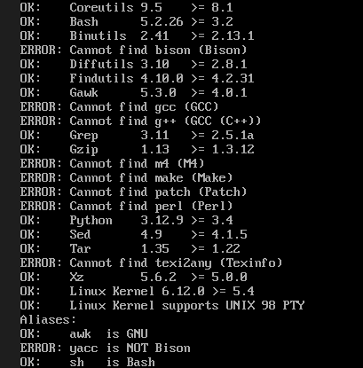
*Figura 1:  Requisitos que faltan en el build system(Rocky Linux)*

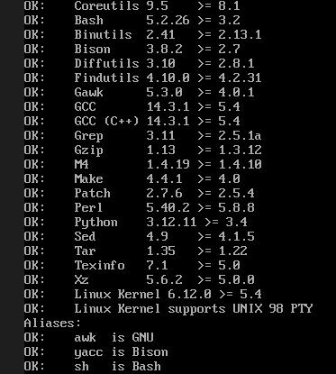
*Figura 2:  Requisitos necesarios cumplidos*

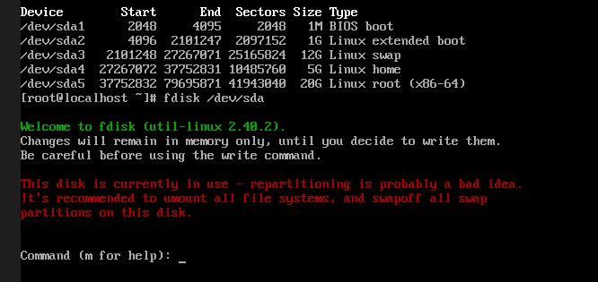
*Figura 3:  Advertensia del fdisk *

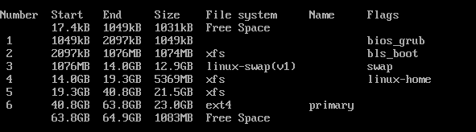
*Figura 4:  Creación de la particion con parted*

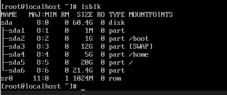
*Figura 5:  Output del comando lsblk para ver partition nueva para lfs*

# Sesión 3: 29 de Noviembre - 09:47 a  11:21 - Configuración del Entorno LFS y Descarga de Paquetes

## Participantes: Marcelo Avalos 
## Objetivo: Configurar entorno LFS, crear estructura de directorios y descargar todos los paquetes.

## Tareas Realizadas
(09:47 - 10:03 )

Configurar variable de entorno LFS

Tener umask correcto para permisos seguros

Montar partición de LFS en el punto de montaje

Asignar permisos de ownership y acceso

Crear directorio sources con permisos correctos

(10:03 - 10:37)

Descargar paquetes fuente usando wget-list-systemd

(10:37 - 11:07)

Completar descargas faltantes desde el mirror 

(11:07 - 11:21)

Verificar que todos los archivos están correctamente descargados con md5sums

Asignar root como dueño de los paquetes descargados

## Comandos Ejecutados

#### Configurar variables de entorno 

export LFS=/mnt/lfs

umask 022

#### Montar partición LFS

mkdir -pv $LFS

mount -v -t ext4 /dev/sda6 $LFS

#### Asignar permisos de ownership y acceso

chown root:root $LFS

chmod 755 $LFS

#### Crear directorio sources y configurar permisos

mkdir -v $LFS/sources

chmod -v a+wt $LFS/sources

#### Descargar paquetes usando el wget-list-systemd del manual

cd $LFS/sources

wget https://www.linuxfromscratch.org/lfs/view/stable-systemd/wget-list-systemd

wget --input-file=wget-list-systemd --continue --directory-prefix=$LFS/sources

#### Descargar paquetes faltantes usando uno de los mirrors disponibles

wget --input-file=wget-list-systemd-mirror --continue --directory-prefix=$LFS/sources

#### Verificar integridad de los paquetes

pushd $LFS/sources

  md5sum -c md5sums

popd

#### Ver si hay alguna linea que no termina en OK

md5sum -c md5sums | grep -v “OK”

#### Asignar root como dueño de paquetes descargado

chown root:root $LFS/sources/*

## Problemas Encontrados

Problema 1: Algunos paquetes fallaron en la descarga con la lista oficial

Causa: Problemas de conectividad con los servidores oficiales

Solución: Usar mirror alternativo https://lfs.gnlug.org/pub/lfs/lfs-packages/12.4/ para completar las descargas. Se uso una inteligencia artificial para que copie la direccion url de cada paquete + el nombre de cada paquete, ej : https://lfs.gnlug.org/pub/lfs/lfs-packages/12.4/acl-2.3.2.tar.xz . Se hizo esto para cada paquete y se creó un archivo wget-list-systemd-mirror y se uso este mismo archivo como se usó el original ej: wget --input-file=wget-list-systemd-mirror --continue --directory-prefix=$LFS/sources. Así se consigue descargar todos los paquetes

Problema 2: Necesidad de verificar integridad de paquetes descargados

Causa: Descargas desde múltiples fuentes

Solución: Usar md5sum -c md5sums y md5sum -c md5sums | grep -v “OK”, regex con grep para validar todos los archivos y verificar

Problema 3: Se apagó inesperadamente la PC

Causa: Corte de electricidad inesperada

Solución: Montar $LFS de nuevo y asegurarse de que todo tenga los privilegios necesarios ejecutando los comandos de permisos nuevamente

Problema 4: md5sum: WARNING 1 line is improperly formatted 

Causa: Puede ser descarga incorrecta, no estoy muy seguro

Solución: Se volvió a descargar el archivo, y no volvió a causar errores o warnings

## Resultados Obtenidos

Variables de entorno LFS configuradas

Partición LFS montada y con permisos adecuados

Directorio sources creado con permisos a+wt

Todos los paquetes de LFS descargados

Archivos verificados con md5sum

Entorno preparado comenzar la construcción de LFS

## Reflexión Técnica

Al parecer es muy común tener que usar mirrors para descargar paquetes faltantes, así que el uso de mirrors es importante aprender a usar. La verificación con md5sum da confianza de que los paquetes o archivos se descargaron correctamente y además sirve para ver si faltó alguno, lo cual es un plus extra.
Usamos el directorio $LFS/sources (/mnt/lfs/sources ) como lugar donde descargar los paquetes y donde se va a construir cada paquete, tiene doble función para que las variables de entornos queden limpias.

## Evidencias

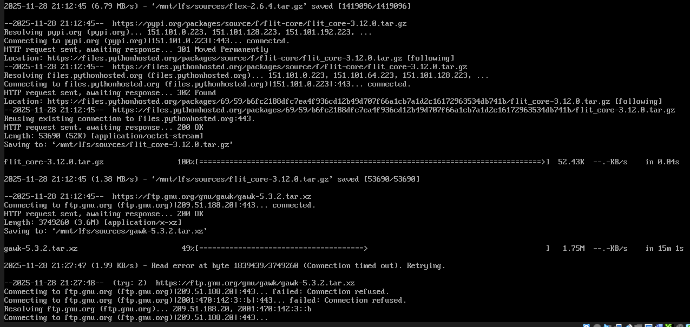
*Figura 1: wget-list-systemd no pudo descargar todos los archivos*

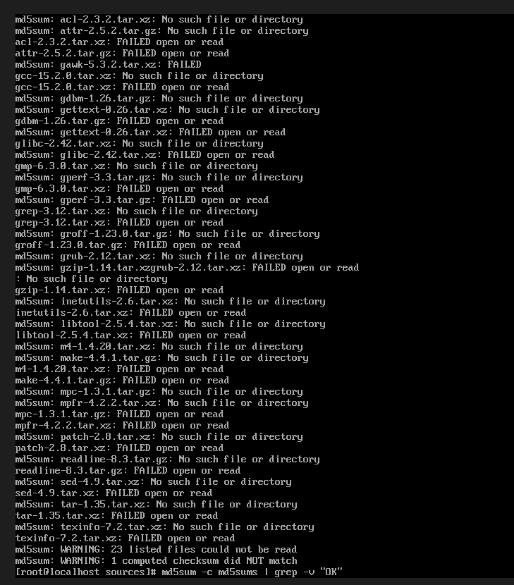
*Figura 2: Archivos fallados verificado con md5sum*

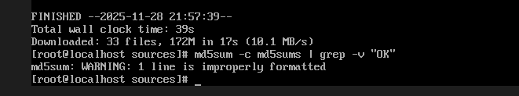
*Figura 3: Error del archivo md5sums*

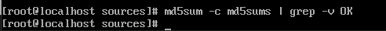
*Figura 4: Integridad de archivos confirmados y no falta paquetes*

# Sesión 4: 30 de Noviembre - 10:56 a 11:55- Configuración Completa del Usuario LFS y Estructura de Directorios, Preparación Final

## Participantes: Marcelo Avalos
## Objetivo: Crear estructura de directorios LFS, usuario lfs, configurar entorno de construcción

## Tareas Realizadas

(10:56 - 11:05)
 - Crear estructura de directorios para LFS
 - Crear enlaces simbólicos 
 - Crear directorio lib64 para x86_64

(11:05 - 11:27)
 - Crear directorio tools para el toolchain.
 - Crear grupo y usuario lfs
 - Crear password para el usuario lfs
 - Cambiar de ownership a los directorios de LFS, a el usuario lfs

(11:27 - 11:55)
 - Configurar archivos de entorno (.bash_profile y .bashrc)
 - Verificar variables de entorno correctos

## Comandos Ejecutados

#### Crear estructura básica de directorios LFS
mkdir -pv $LFS/{etc,var} $LFS/usr/{bin,lib,sbin}

#### Crear enlaces simbólicos 
for i in bin lib sbin; do
  ln -sv usr/$i $LFS/$i
done

#### Crear lib64 
case $(uname -m) in
  x86_64) mkdir -pv $LFS/lib64 ;;
esac

#Crear directorio tools 
mkdir -pv $LFS/tools

#### Crear grupo y usuario lfs 
groupadd lfs
useradd -s /bin/bash -g lfs -m -k /dev/null lfs
passwd lfs

#### Cambiar owner
chown -v lfs $LFS/{usr{,/*},var,etc,tools}
case $(uname -m) in
  x86_64) chown -v lFS/lib64 ;;
esac

#### Configurar bashrc y bash_profile
cat > ~/.bash_profile << "EOF"
...
EOF

cat > ~/.bashrc << "EOF"
....
EOF

## Verificar configuración completa
ls -la $LFS/

ls -la $LFS/tools

id lfs

source ~/.bash_profile

echo "LFS: $LFS"

echo "LFS_TGT: $LFS_TGT"

## Problemas Encontrados

Problema 1: Se creó el directorio $LFS/toools en vez de $LFS/tools

Causa: Se añadió una o de más al hacer el comando

Solución:Se borró el directorio con rm -rf $LFS/toools y se creó de nuevo el directorio correcto.

## Resultados Obtenidos

Estructura de directorios LFS - Crear el sistema de archivos para la instalación

Enlaces simbólicos configurados - Mantener compatibilidad con herramientas del sistema build

Directorio tools creado - Compilar toolchain temporal separado del sistema host

Usuario lfs creado - Aislar la construcción de lfs con un usuario dedicado

Owner de directorios transferido - Dar permisos necesarios de construcción al usuario lfs

Archivos de entorno configurados - Hacer variables para el toolchain temporal

Entorno preparado - Todo listo para compilar las herramientas de desarrollo

## Reflexión Técnica

El tool chain es creado en la carpeta $LFS/tools para separarlos del host.La creación del usuario lfs nos asegura aislar del root con demasiados privilegios peligrosos para la construcción del lfs. A este punto se está listo para comenzar la instalación  del tool chain (binutils, gcc, and glibc).El capítulo 4 también habla de los sanity checks , que se hacen más adelante para asegurar la instalación correcta.

## Evidencias

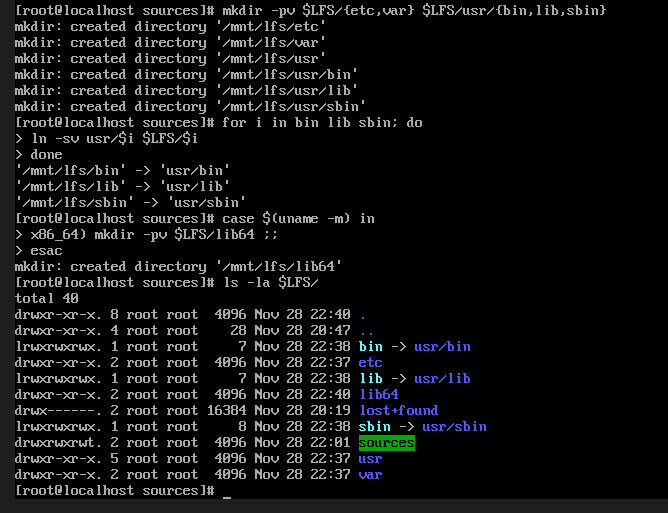
*Figura 1: Directorios necesarios y enlaces simbólicos*

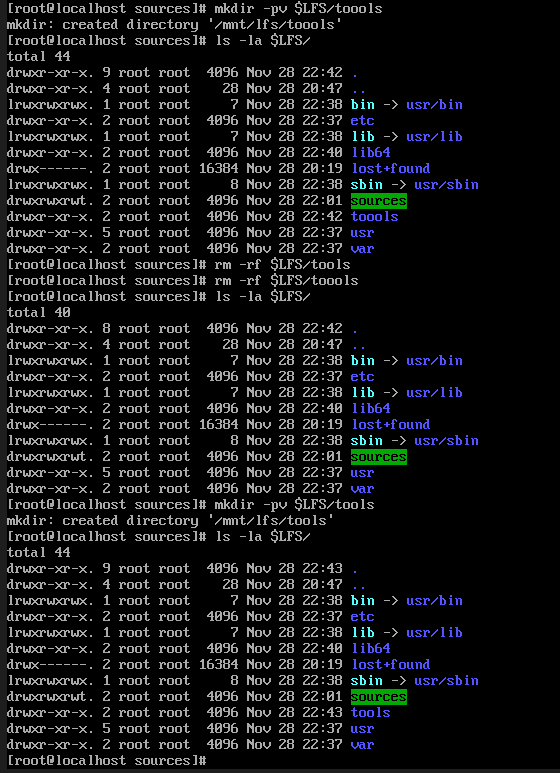
*Figura 2: Directorio creado con nombre incorrecto*

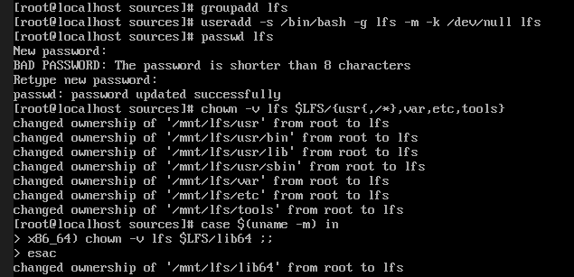
*Figura 3: Usario lfs creado y los permisos para crear*

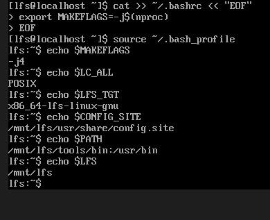
*Figura 4: Pruebas del funcionamiento de bashrc*

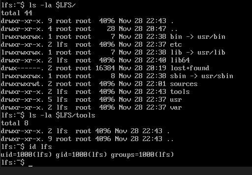
*Figura 5: Pruebas extra*

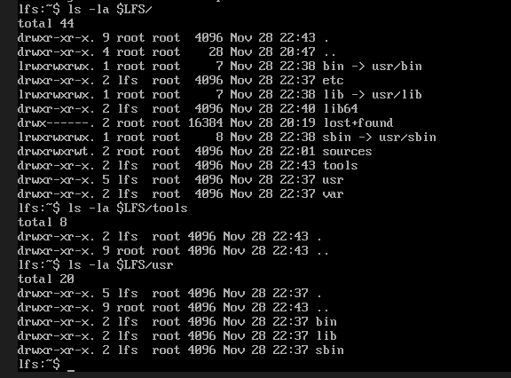
*Figura 5: Demostración de Privilegio lfs*

---

# Sesión 5: 1 de Diciembre - Instalación de cross-toolchain (Pass 1)

## Objetivo: Instalar el cross-toolchain (Binutils, GCC, Linux Headers y Glibc) en el directorio $LFS/tools y la partición $LFS para preparar el entorno de cross compilation

## Tareas Realizadas

(15:22 - 15:53)
 - 5.2. Binutils-2.45 - Pass 1. 

(15:53 - 17:05)
 - 5.3. GCC-15.2.0 - Pass 1. 

(17:05 - 17:16)
 - 5.4. Linux-6.16.1 API Headers: Instalación de los headers del kernel . 

(17:16 -18:42)
 - 5.5. Glibc-2.42 - Pass 1:. 
 - Ejecución y verificación de las pruebas de sanity checks.

## Comandos principales ejecutados:

#Todos los paquetes

tar -xf [nombre-a-instalar]

cd [nombre-a-instalar]

### Binutils-2.45 - Pass 1

mkdir -v build;  #crear directorio para el build
cd build    #acceder a dicho directorio

#configuraciones para la compilación 1 pass.
../configure --prefix=$LFS/tools --with-sysroot=$LFS --target=$LFS_TGT ...

#compilar
make

#instalar
make install

### GCC-15.2.0 - Pass 1

#Extracción de dependencias (mpfr, gmp, mpc)

#sed para x86_64
mkdir -v build; cd build

../configure --target=$LFS_TGT --prefix=$LFS/tools --with-newlib ...

make
make install

#Crear la version completa del header limits.h
cat gcc/limitx.h ... > $(dirname $($LFS_TGT-gcc -print-libgcc-file-name))/include/limits.h

### Linux-6.16.1 API Headers

#Asegurar de eliminar configuraciones previas
make mrproper

#Genera los headers kernel 
make headers

#Copia los headers del kernel a $LFS/usr/include para que Glibc use
cp -rv usr/include $LFS/usr

### Glibc-2.42 - Pass 1

#Crea enlaces simbólicos 
case $(uname -m) in ..

#Aplica parche
patch -Np1 -i ../glibc-2.42-fhs-1.patch

#Crea directorio build separado para compilación
mkdir -v build; cd build

#Configura Glibc para instalar programas en /usr/sbin en vez de /sbin
echo "rootsbindir=/usr/sbin" > configparms

../configure --prefix=/usr --host=$LFS_TGT --enable-kernel=5.4 ...

make

#Instala Glibc en $LFS 
make DESTDIR=$LFS install

#Usar /lib en lugar de /usr/lib
sed '/RTLDLIST=/s@/usr@@g' -i $LFS/usr/bin/ldd

### Sanity Checks

echo 'int main(){}' | $LFS_TGT-gcc -x c - -v -Wl,--verbose &> dummy.log

readelf -l a.out | grep ': /lib'

grep -E -o "$LFS/lib.*/S?crt[1in].*succeeded" dummy.log

grep -B3 "^ $LFS/usr/include" dummy.log

grep 'SEARCH.*/usr/lib' dummy.log |sed 's|; |\n|g'

grep "/lib.*/libc.so.6 " dummy.log

grep found dummy.log

rm -v a.out dummy.log

## Resultados:

#### Binutils – Pass 1
Se compila solo las herramientas básicas para manipular binarios. Suficiente para que GCC Pass 1 funcione.

#### GCC – Pass 1  
Compilador de C/C++ limitado. Todavía funciona como cross-compiler y solo compila Glibc.

#### Linux API Headers
Headers públicos del kernel Linux. Definen cómo los programas de usuario hablan con el kernel.

#### Glibc – Pass 1
Biblioteca C mínima. Hace que GCC Pass 2 pueda crear programas que corran en LFS.

Resultado de Sanity Checks:Se confirmó que el dynamic linker apunta a la dirección correcta de $LFS y que los archivos se encontraron.

## Problemas Encontrados

Problema: Durante la configuración de Glibc, el compilador del host arrojó una warning de que el programa msgfmt era incompatible.

configure: WARNING: *** These auxiliary programs are missing or ... msgfmt ***

Solución: Se continuó, según en la documentación de LFS,esto es normal.

Problema: Al escribir el comando para el configure de binutils se escribió mal uno de las configuraciones.

Causa: Se apretó enter sin querer antes del ‘\’ que se usa para seguir el comando en la proxima linea.

Solución: Se removió todo el directorio que se extrajo, con rm -rf binutils…. , y se volvió a extraer, reseteando así la configuración.

Problema: No es realmente un problema pero en glib, al crear los symbolic links, el output salia como :
 '/mnt/lfs/lib64/ld-linux-x86-64.so.2' -> '../lib/ld-linux-x86-64.so.2'

 '/mnt/lfs/lib64/ld-lsb-x86-64.so.3' -> '../lib/ld-linux-x86-64.so.2'

Causa: aparentemente, al recibir el output de los comandos de lfs, el formato está hecho por ln -v, que funciona mostrando ‘target’ -> ‘link_name’, en cambio ls muestra: ‘link_name’ - > ‘target’,por lo que al tratar de confirmar parece estar al revez, pero, efectivamente está bien.

## Aprendizaje:
Se crea el chroot(el root para el $LFS), como el LFS no tiene nada todavia, usamos el toolchain del Build system (Rocky Linux) , esto se llama cross-toolchain porque se usa el toolchain de Build system para el $LFS, que vendría a ser otro systema. Tenemos que asegurarnos de que las variables de entorno de Build no se pasen al LFS que construimos, para eso usamos muchos atributos en los ./configure.

## Reflexión Técnica

Es importante prestar atención a los detalles y no obviar alguna advertencia del manual. Es muy fácil tipear algo mal, por eso se recomienda usar tee -a nombre-del-log.log para poder identificar rápidamente el problema.
Los sanity checks son importantes para ahorrar tiempo en el largo plazo.

## Evidencias

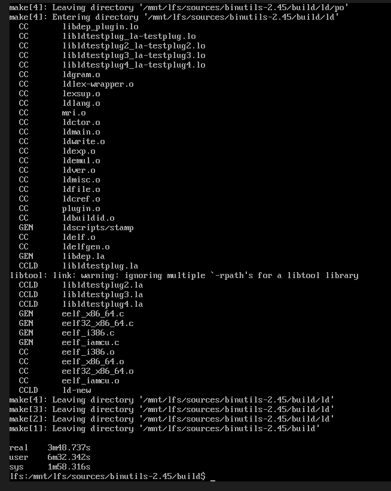
*Figura 1: Binutils make*

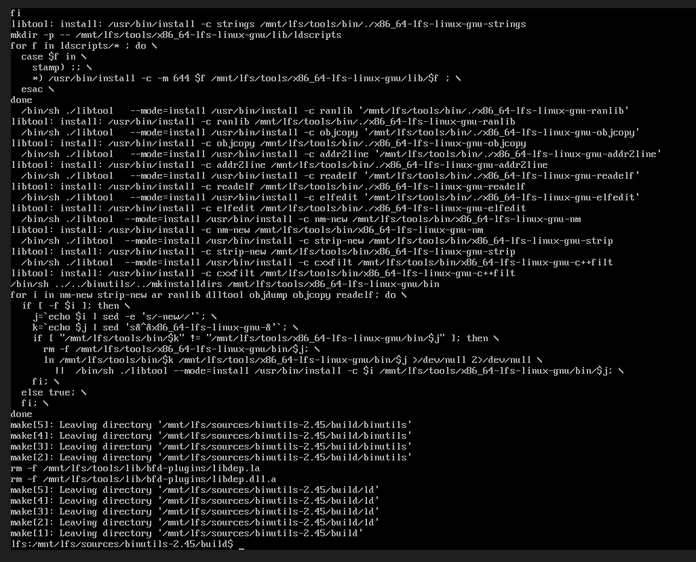
*Figura 2: Binutils make install*

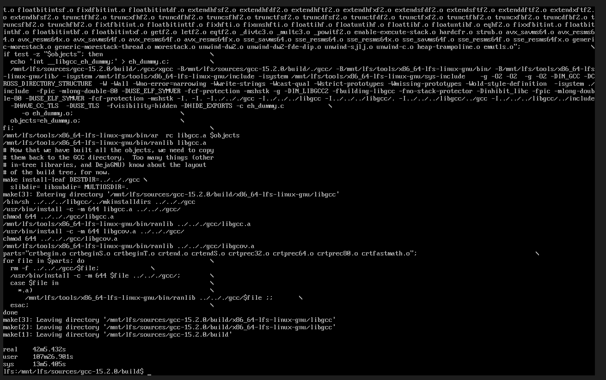
*Figura 3: Gcc make*

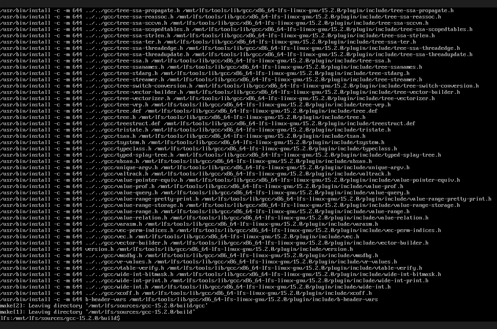
*Figura 4: Gcc make install*

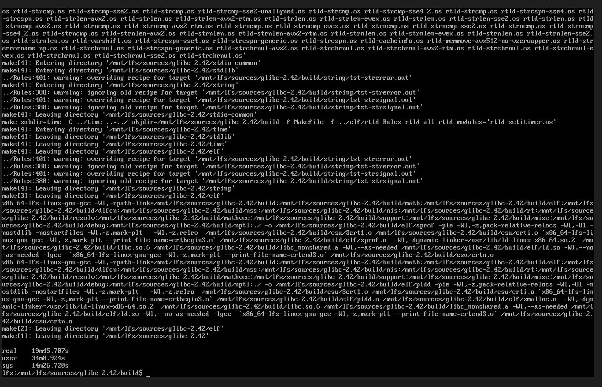
*Figura 5: Glibc make*

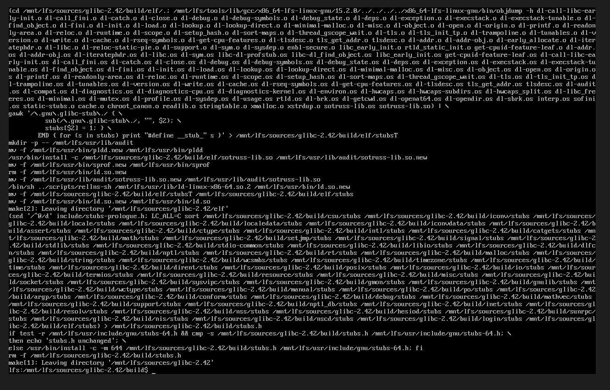
*Figura 6: Glibc make install*

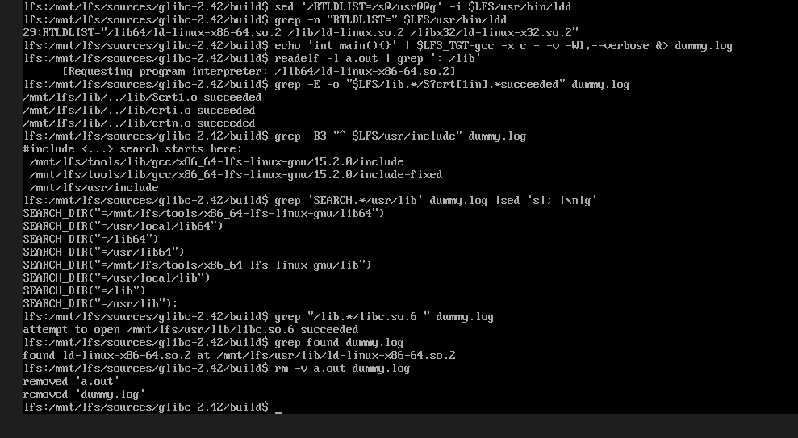
*Figura 7: Glibc sanity check*

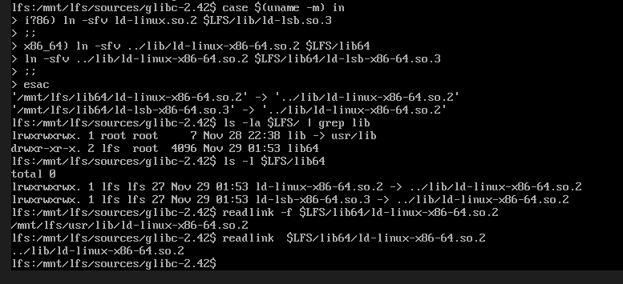
*Figura 8: Output del commando de symbolic link en glib*

---

# Sesión 6: 2 de Diciembre - Cross Compiling Temporary Tools

## Objetivo: Hacer la instalación de temporary tools necesarias para el entorno de cross-compilation (Libstdc++, M4, Ncurses, Bash, Coreutils, Diffutils)

## Tareas Realizadas

(12:14 - 12:33)
- 5.6. Libstdc++

(12:33 -  12:50)
- 6.2. M4-1.4.20 

( 12:50 - 13:33)
- 6.3. Ncurses-6.5-20250809 

(13:33 - 13:54)
- 6.4. Bash-5.3 

(13:54 - 14:08)
- 6.5. Coreutils-9.7 

(14:08- 14:24)
- 6.6. Diffutils-3.12

## Comandos principales ejecutados:

### Libstdc++

mkdir -v build
cd build

../libstdc++-v3/configure \
… #Usar el cross-compiler que armamos, no el que está en /usr/bin
#Especifica donde se compila, y el directorio raíz
#Deshabilitar la instalación de archivos pre-compilados 
#Especificar la dirección de la carpeta a instalar los archivos include 
#Deshabilitar bibliotecas para múltiples arquitecturas
Make

make DESTDIR=$LFS install

rm -v $LFS/usr/lib/lib{stdc++{,exp,fs},supc++}.la

### M4-1.4.20

./configure --prefix=/usr \
           … #Se indica el directorio raiz $LFS/usr
#Se indica para que architectura $LFS_TGT
#Arquitectura del sistema actual donde se está compilando

Make

make DESTDIR=$LFS install

### Ncurses-6.5-20250809

mkdir build
pushd build

  ../configure --prefix=$LFS/tools AWK=gawk

  make -C include

  make -C progs tic

  install progs/tic $LFS/tools/bin

popd

./configure --prefix=/usr \
         …#Se indica el directorio raiz $LFS/usr
#Se indica para que architectura $LFS_TGT
#Arquitectura del sistema actual donde se está compilando
#Se usa gawk para no usar mawk que puede causar problemas
#Se disabilità soporte para Ada
 
Make

make DESTDIR=$LFS install

ln -sv libncursesw.so $LFS/usr/lib/libncurses.so

sed -e 's/^#if.*XOPEN.*$/#if 1/' \
    -i $LFS/usr/include/curses.h

### Bash-5.3

./configure --prefix=/usr \
       …
#Se deshabilita el malloc interno del bash porque puede causar problemas de segmentación. Se usa el malloc de Glib

Make

make DESTDIR=$LFS install

ln -sv bash $LFS/bin/sh

### Coreutils-9.7

./configure --prefix=/usr \
…
#Perl necesita el hostname, entonces se habilita la compilación e instalación de hostname.

Make

make DESTDIR=$LFS install

mv -v $LFS/usr/bin/chroot $LFS/usr/sbin

mkdir -pv $LFS/usr/share/man/man8

mv -v $LFS/usr/share/man/man1/chroot.1 $LFS/usr/share/man/man8/chroot.8

sed -i 's/"1"/"8"/' $LFS/usr/share/man/man8/chroot.8

### Diffutils-3.12

./configure --prefix=/usr \
           …
#Hace que se asuma que el resultado de strcasecmp sea y por predeterminado

Make

make DESTDIR=$LFS install

## Resultados Obtenidos

#### Libstdc++  instalado exitosamente

Biblioteca estándar de C++. Se instala una versión temporal para poder compilar programas en C++ durante el cross-compilation.

#### M4-1.4.20 - instalado correctamente

Procesador de macros utilizado por herramientas como Autoconf.Muchos paquetes usan Autoconf para generar scripts de configuración.

#### Ncurses-6.5-20250809 - instalado

Librería para manipular pantallas de terminal de forma independiente .Es necesario porque varios programas del sistema (como Bash) dependen de esto para manejar la interacción con la terminal.

#### Bash-5.3 - instalado y enlace simbólico creado

Shell del sistema.Se instala una versión temporal, que se usará dentro del entorno chroot.
El shell es necesario para ejecutar scripts y comandos durante las siguientes fases del LFS.

#### Coreutils-9.7 - instalado y ubicado correctamente

Conjunto de comandos básicos del sistema (ls, cp, mv, mkdir, etc.). Necesarios para manipular archivos y directorios dentro del entorno LFS.

#### Diffutils-3.12 - instalado

Herramientas para comparar archivos (diff, cmp, etc.). Se usan para aplicar parches y revisar cambios en los paquetes que se compilan.

## Problemas Encontrados

Problema: Al installar ncurses queria corroborar si las ultimas lineas de sed (sed -e 's/^#if.*XOPEN.*$/#if 1/' \
    -i $LFS/usr/include/curses.h
funcionaron y se ejecutaron correctamente, pero no se comprendía cómo hacerlo.

Solucion:Al hacer grep -n XOPEN $LFS/usr/include/curses.h, se obtuvo sólo 2 comentarios con 
XOPEN en las líneas, y un #define _XOPEN_CURSES 1, que solo define como valor, entonces se comprobo que funciono correctamente.

## Reflexión Técnica

Se deshabilitó el allocador de memoria interno del Bash para usar el de Glibc que es más estable.
Para el proceso de cross-compilation se requiere una comprensión tremenda de las dependencias entre paquetes y las herramientas que se utilizan en cada etapa. El orden influye mucho también.
Como en la sesión anterior cada paquete requiere una configuración específica para el entorno de cross-compilation.
Al hacer el LFS fue una sorpresa ver a Linux no como un sistema solamente, sino que múltiples componentes interdependientes que pueden ser compilados e instalados secuencialmente. 

## Evidencia
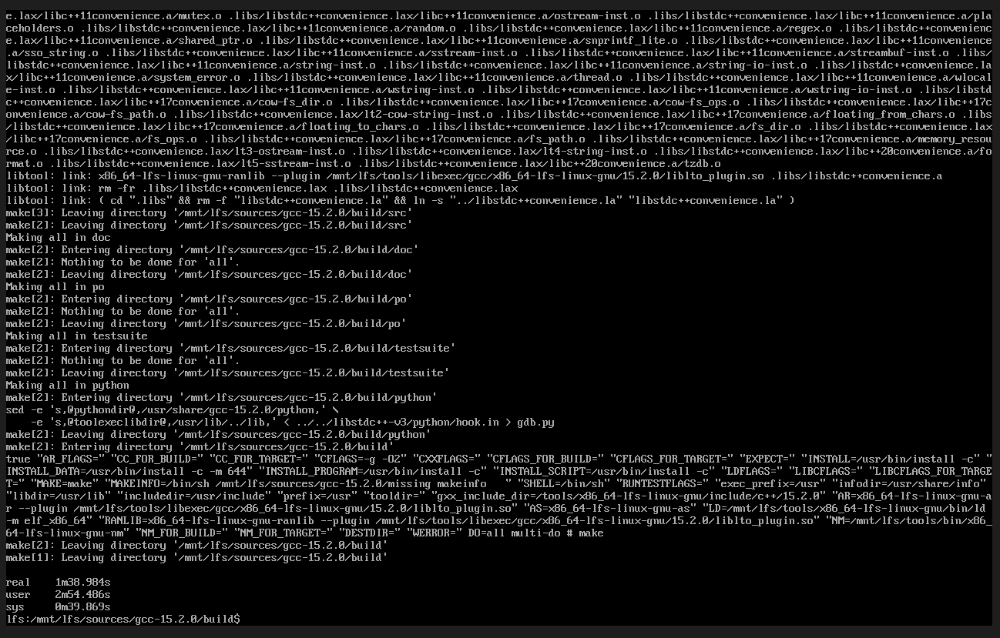
*Figura 1: ibstdc++ make*

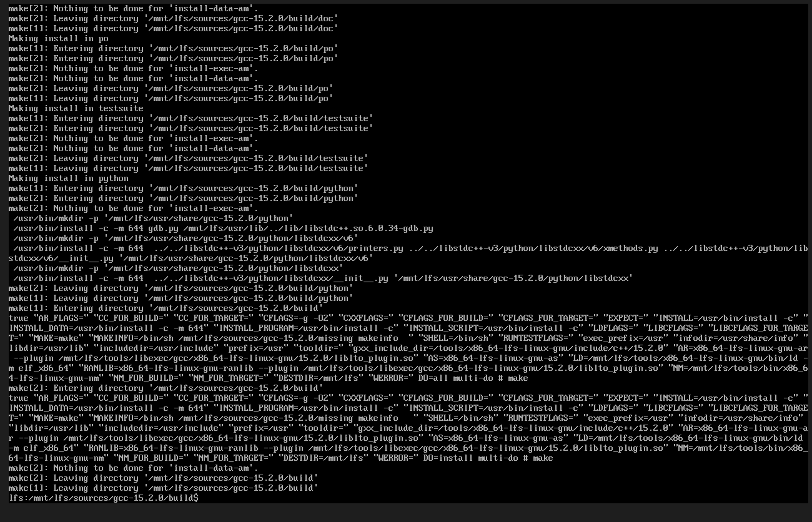
*Figura 2: libstdc++ make install*

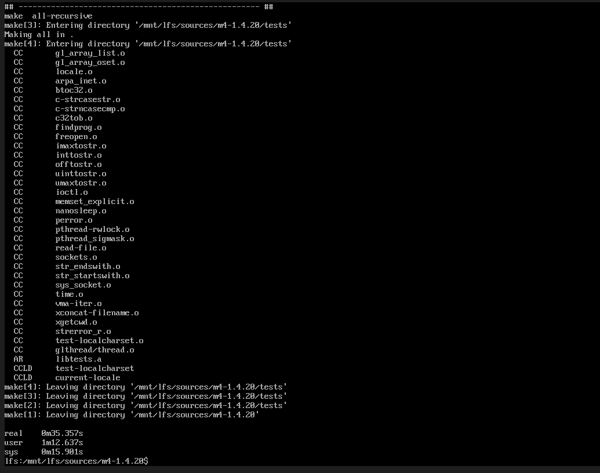
*Figura 3: m4 make*

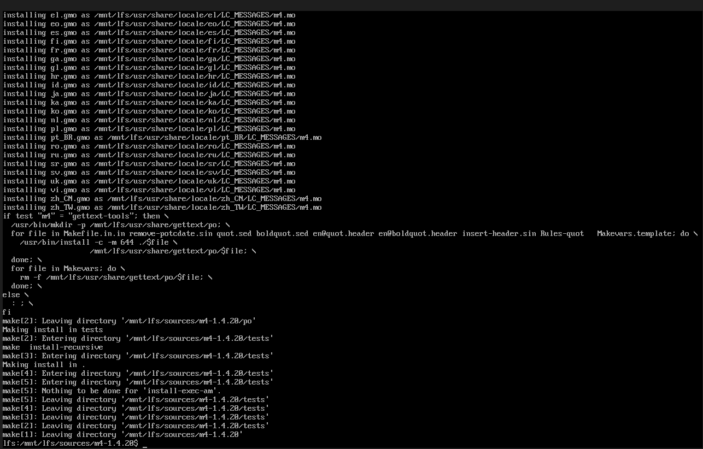
*Figura 4: m4 make install*

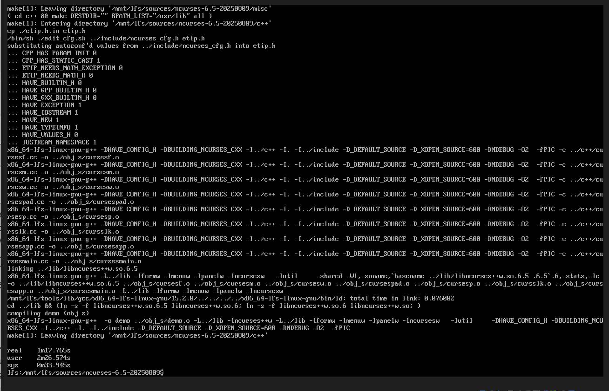
*Figura 5: ncurses make*

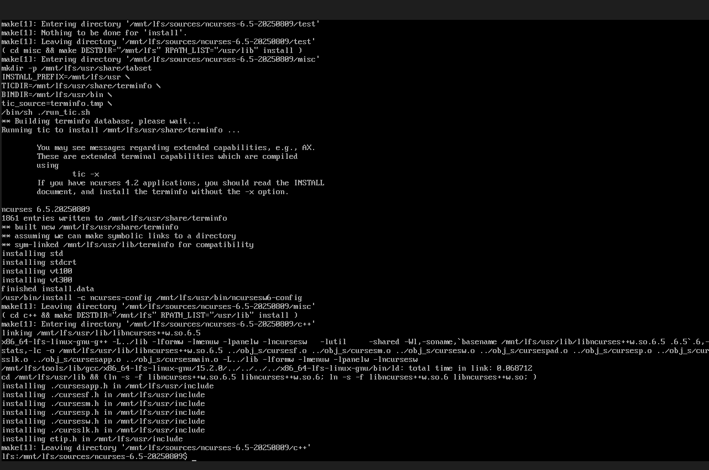
*Figura 6: ncurses make install*

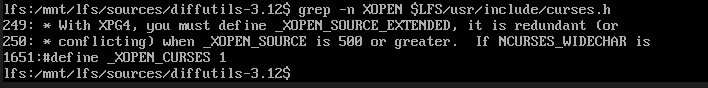
*Figura 7: ncurses problema*

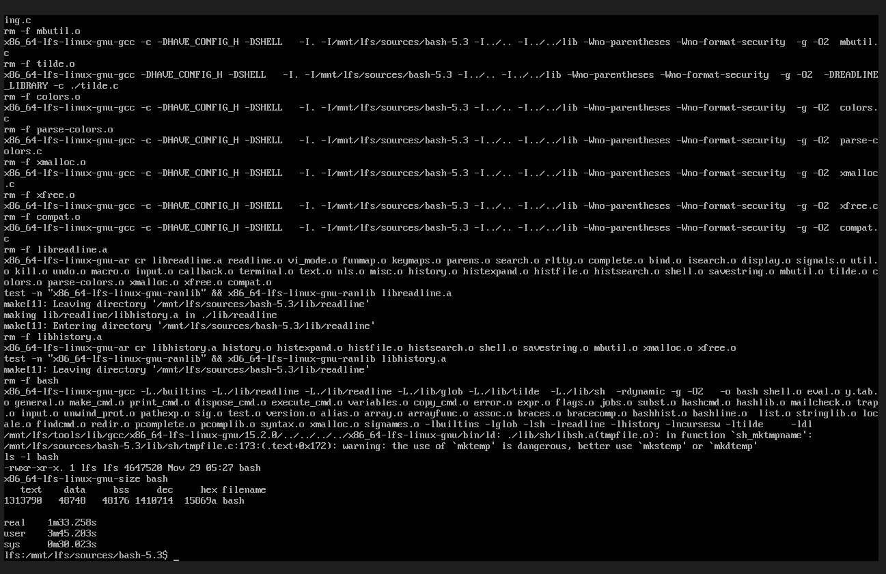
*Figura 8: bash  make*

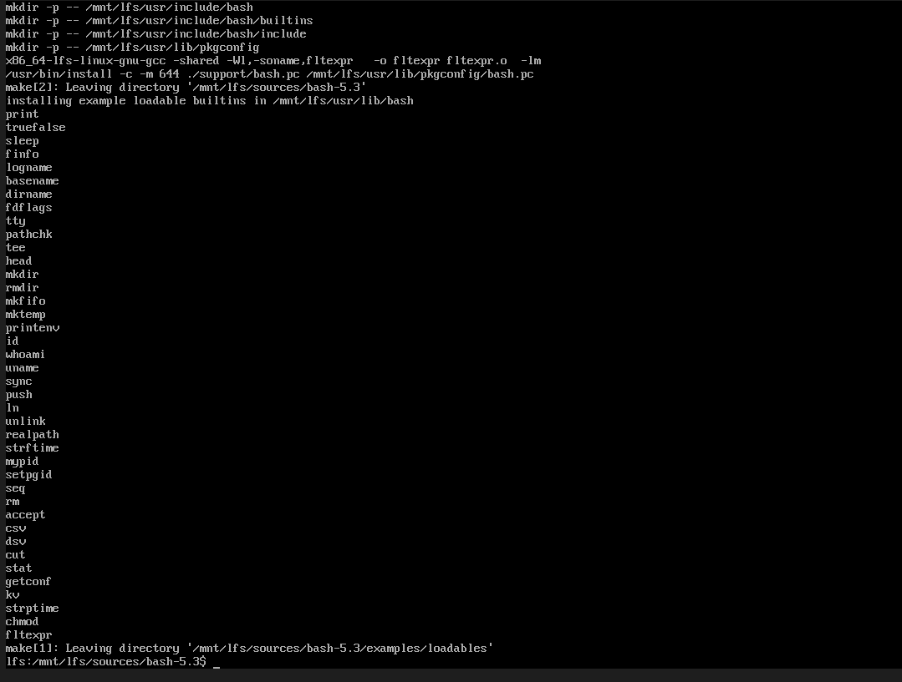
*Figura 9: bash make install*

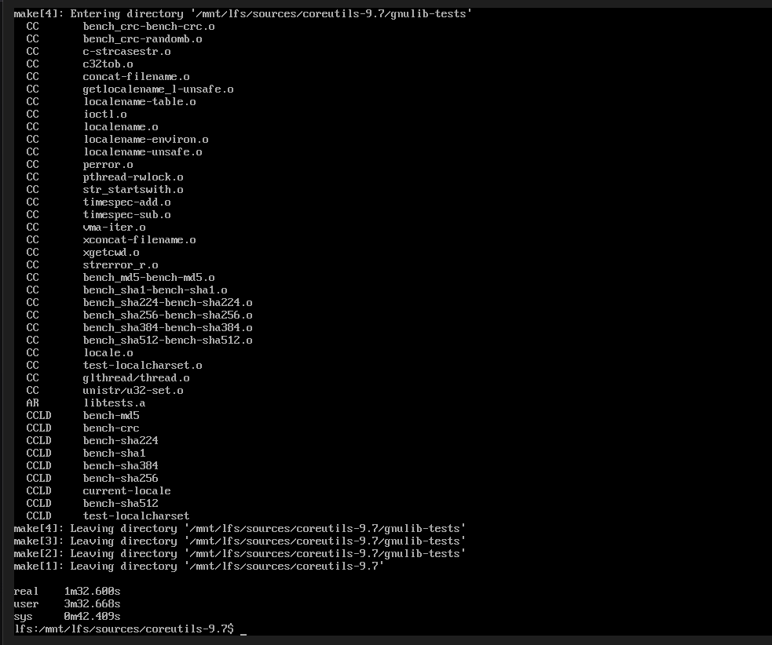
*Figura 10: coreutils make*

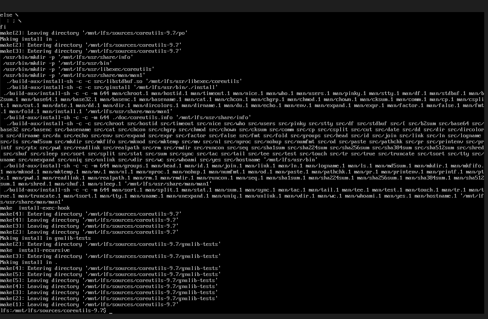
*Figura 11: coreutils make install*

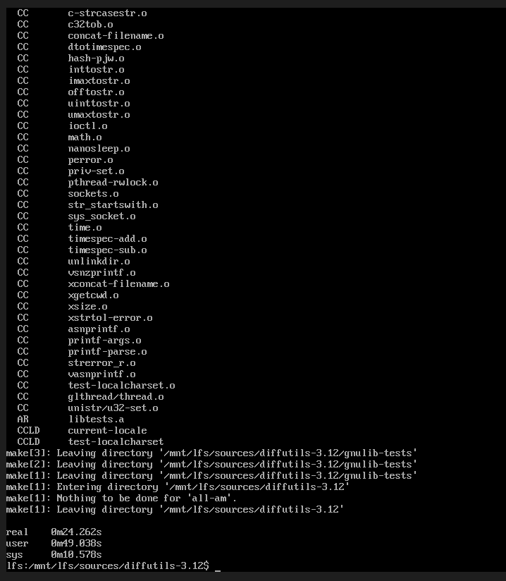
*Figura 12: diffutils make*

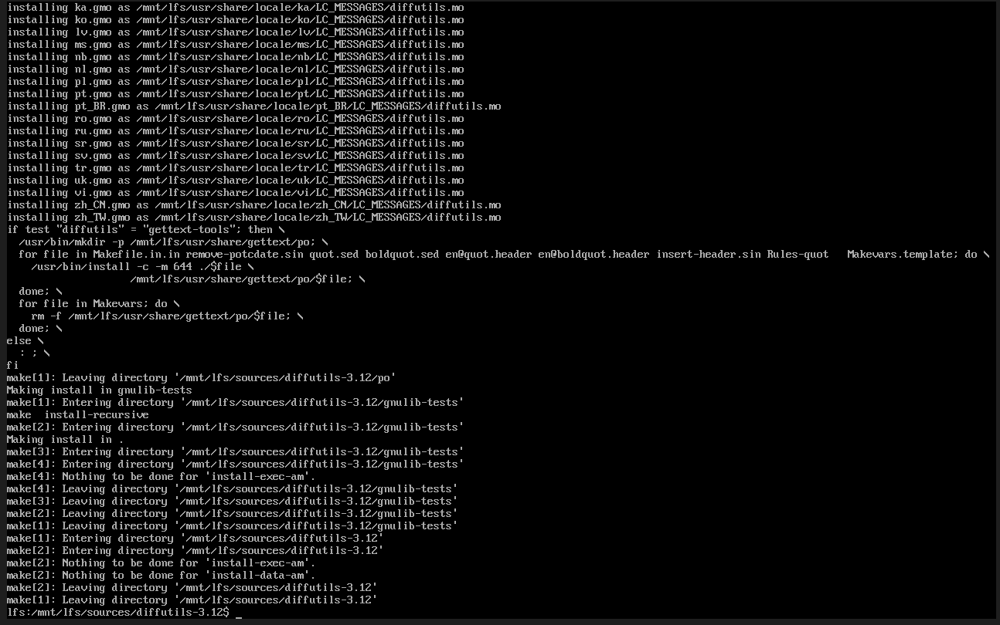
*Figura 13: diffutils make install*

---

# Sesión 7: 3 de Diciembre - Cont - Cross Compiling Temporary Tools

## Objetivo: Continuacion de la instalación de temporary tools necesarias para el entorno de cross-compilation (File, Findutils,Gawk,Grep,Gzip,Make)

## Tareas Realizadas

(11:20 - 11:41)
 - 6.7 File 

(11:40 - 11:56)
 - 6.8 Findutils

(11:56 - 12:09)
 - 6.9 Gawk

(12:09 - 12:26)
 - 6.10 Grep

(12:26 - 12:41 )
 - 6.11 Gzip

(12:41 - 13:04)
 - 6.12 Make

## Comandos principales ejecutados:

### File-5.46
#Creamos copia de File en el build system para crear el signature file necesario.
mkdir build
pushd build
  ../configure --disable-bzlib      \  #Si existen las librerías en lfs, este config no les permite 
               --disable-libseccomp \  #ejecutarse, para la estabilidad de la compilación.
               --disable-xzlib      \
               --disable-zlib
  make
popd

 
#configuracion 
./configure --prefix=/usr --host=$LFS_TGT --build=$(./config.guess)

#Compilar
make FILE_COMPILE=$(pwd)/build/src/file

#Instalar
make DESTDIR=$LFS install

rm -v $LFS/usr/lib/libmagic.la

### Findutils-4.10.0

#Configuracion
./configure --prefix=/usr                   \
            --localstatedir=/var/lib/locate \
            --host=$LFS_TGT                 \
            --build=$(build-aux/config.guess)

#Compilar
make

#Instalar
make DESTDIR=$LFS install

### Gawk-5.3.2

#Subsistuir extras por un espacio vacio en el archivo Makefile.in

sed -i 's/extras//' Makefile.in

#Configuracion

./configure --prefix=/usr   \
            --host=$LFS_TGT \
            --build=$(build-aux/config.guess)

#Compilar
make

#Instalar
make DESTDIR=$LFS install

### Grep-3.12

#Configuración para compilacion

./configure --prefix=/usr   \
            --host=$LFS_TGT \
            --build=$(./build-aux/config.guess)

#Compilar
make

#Instalar
make DESTDIR=$LFS install

### Gzip-1.14

#Configuración para compilación
./configure --prefix=/usr --host=$LFS_TGT

#Compilar
make

#Instalar
make DESTDIR=$LFS install

### Make-4.4.1

#Configuración del compilador

./configure --prefix=/usr   \
            --host=$LFS_TGT \
            --build=$(build-aux/config.guess)

#Compilar
make

#Instalar
make DESTDIR=$LFS install

## Resultados Obtenidos

#### File-5.46  instalado 

Es una utilidad de línea de comandos que determina el tipo de archivo, sea cual sea su extensión.

#### Findutils-4.10.0 - instalado

Es un paquete de utilidades de búsqueda, sirve para encontrar archivos y directorios en el sistema de archivos.

#### Gawk-5.3.2 - instalado

Es un lenguaje de programación especializado para procesar y analizar texto. Busca patrones en los datos y ejecuta acciones cuando los encuentra.

#### Grep-3.12- instalado 

Es una utilidad de línea de comandos para buscar patrones de texto dentro de archivos. 

#### Gzip-1.14 - instalado 

Es una utilidad para reducir el tamaño de los archivos para que ocupen menos espacio.

#### Make-4.4.1 - instalado

Es una herramienta de automatización de compilación y construcción de software.

## Problemas Encontrados

Ningún problema significante.

## Reflexión Técnica

Se instalaron varios paquetes chicos que sirven más adelante para la utilización y complementación del Linux LFS. Muchos de estos comparten las mismas configuraciones y pasos de compilación e instalación por lo que no hay mucho de qué hablar. Cabe recalcar tal vez que tanto gawk como grep pueden ambos cumplir la misma funcionalidad, pero grep está diseñado por simplicidad de ejecución, y usar gawk en casos simples sería un overkill o usar recursos demas para algo simple.

## Evidencia

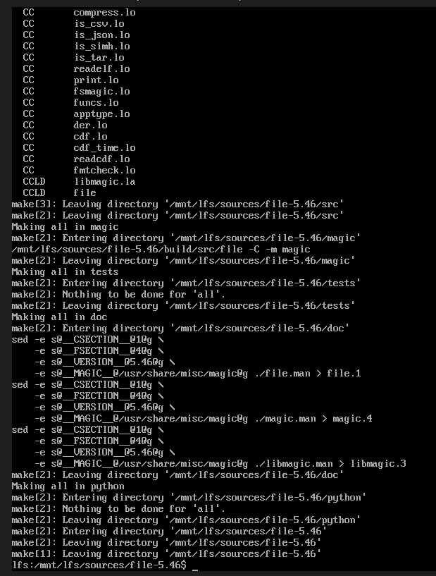
*Figura 1: file make *

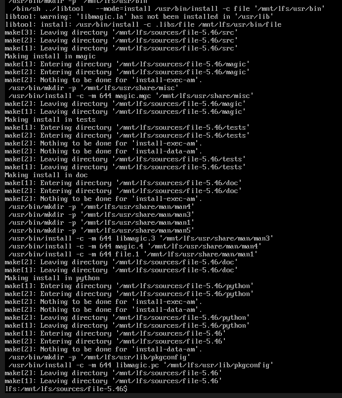
*Figura 2: file make install*

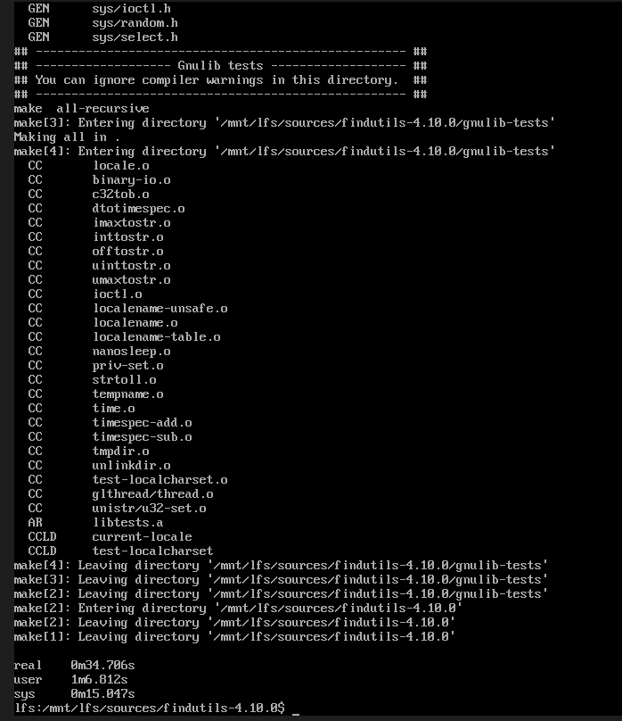
*Figura 3: findutils make*

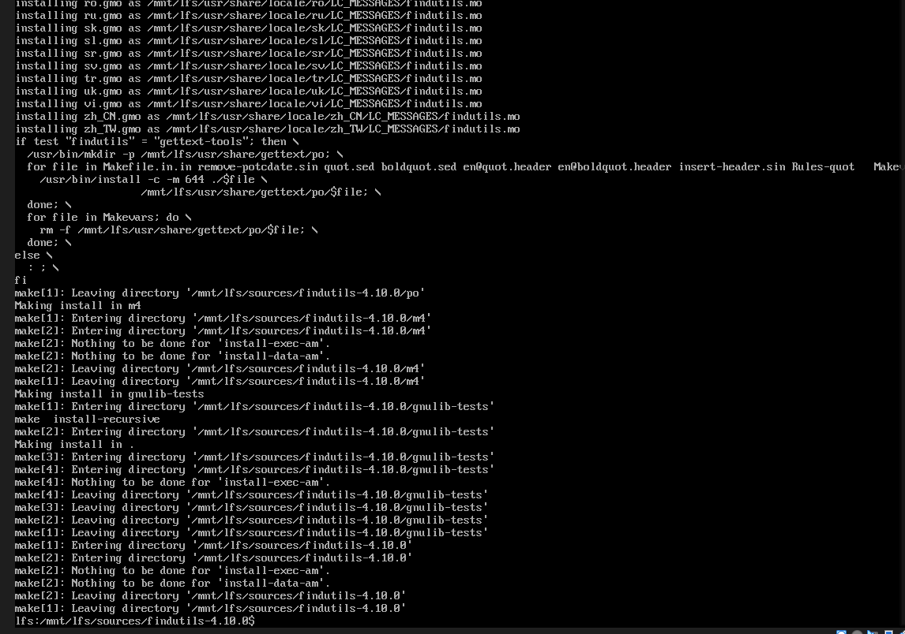
*Figura 4: fintutils make install*

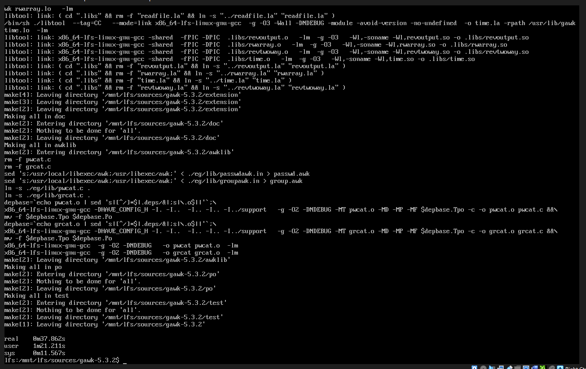
*Figura 5: gawk make*

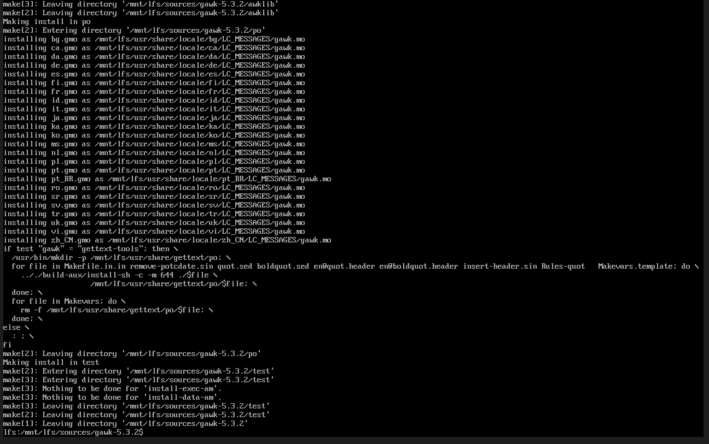
*Figura 6: gawk make install*

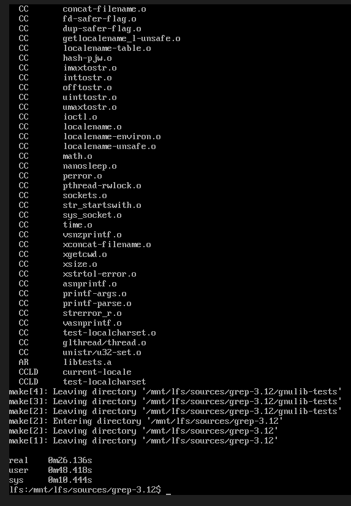
*Figura 7: grep make*

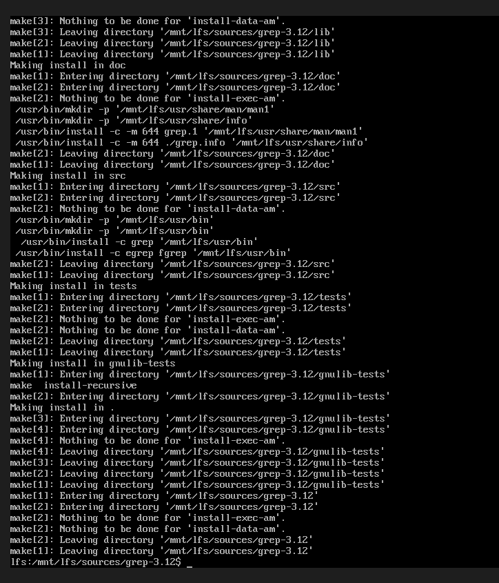
*Figura 8: grepmake install*

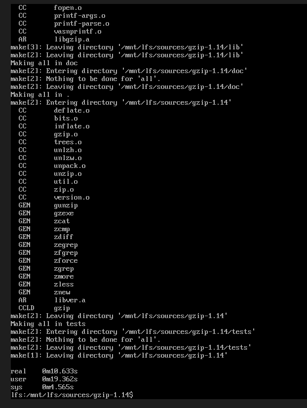
*Figura 9: gzip make*

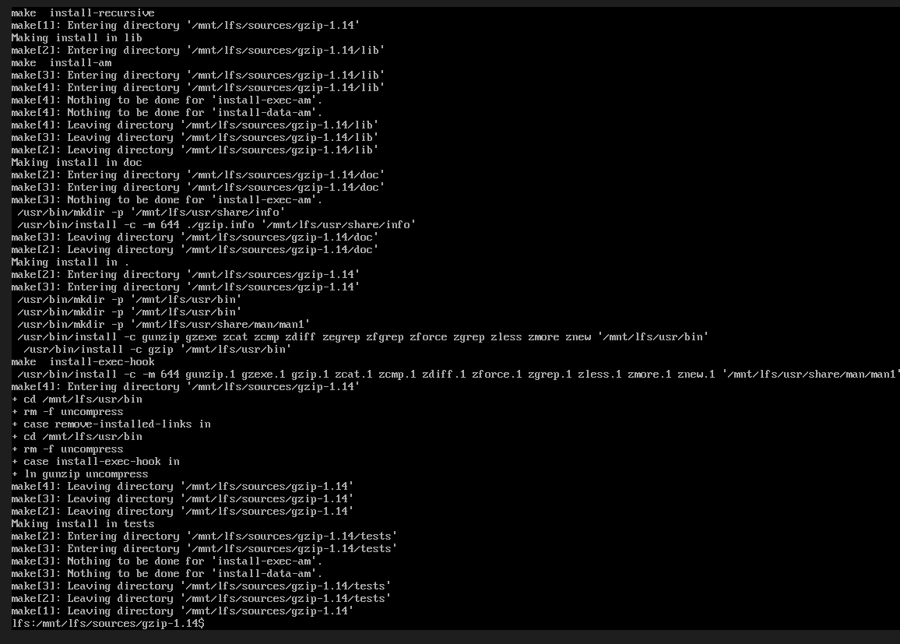
*Figura 10: gzip make install*

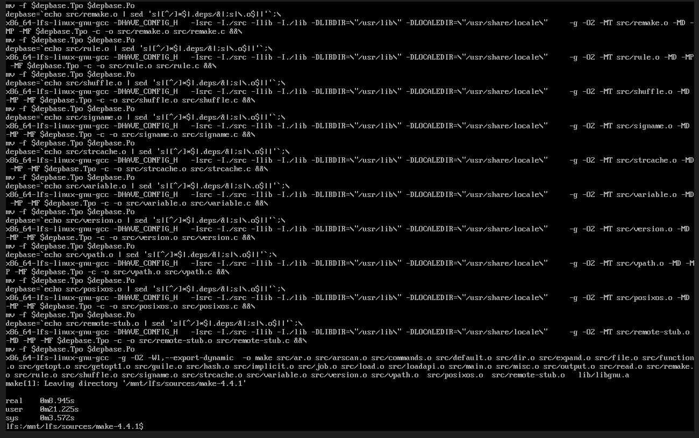
*Figura 11: make make*

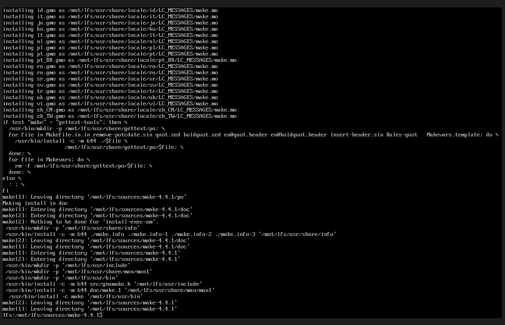
*Figura 12: make make install*

---

# Sesión 8: 4 de Diciembre - Cont 2 - Cross Compiling Temporary Tools

## Objetivo: Continuacion de la instalación de temporary tools necesarias para el entorno de cross-compilation (Patch,Sed,Tar,Xz,Binutils Pass 2)

## Tareas Realizadas

(09:05 - 09:19 )
 - 6.13 Patch

(09:19 - 09:31 )
 - 6.14 Sed

(09:31 - 09:47)
 - 6.15 Tar

(09:47 - 09:56)
 - 6.16 Xz

(09:56-10:34 )
 - 6.17 Binutils

## Comandos principales ejecutados:

### Para los make y make install uso:

make o make install | tee -a $LFS/sources/tee/nombre-de-paquete-make.log o make-install.log

### Patch-2.8
#Configuracion

./configure --prefix=/usr   \
            --host=$LFS_TGT \
            --build=$(build-aux/config.guess)

#Compilar
make

#Instalar
make DESTDIR=$LFS install

### Sed-4.9

#Configuracion

./configure --prefix=/usr   \
            --host=$LFS_TGT \
            --build=$(build-aux/config.guess)

#Compilar
make

#Instalar
make DESTDIR=$LFS install

### Tar-1.35

#Configuracion

./configure --prefix=/usr   \
            --host=$LFS_TGT \
            --build=$(build-aux/config.guess)

#Compilar
make

#Instalar
make DESTDIR=$LFS install

### Xz-5.8.1

#Configuracion

./configure --prefix=/usr                     \
            --host=$LFS_TGT                   \
            --build=$(build-aux/config.guess) \
            --disable-static                  \
            --docdir=/usr/share/doc/xz-5.8.1

#Compilar

make

#Instalar

make DESTDIR=$LFS install

#Remover el archivo libtool,causa problema.
rm -v $LFS/usr/lib/liblzma.la

### Binutils-2.45

#Configuración para compilación
./configure --prefix=/usr --host=$LFS_TGT

#Compilar
make

#Instalar
make DESTDIR=$LFS install

### Binutils-2.45 - Pass 2

#Configuración del compilador

#Evitar symbolic links incorrectos
sed '6031s/$add_dir//' -i ltmain.sh

#Configuración para compilación
../configure                   \
......

#Compilar
make

#Instalar
make DESTDIR=$LFS install

#Remover archivos libtool
rm -v $LFS/usr/lib/lib{bfd,ctf,ctf-nobfd,opcodes,sframe}.{a,la}

## Resultados Obtenidos

#### Patch-2.8  instalado

Es una herramienta que permite modificar código fuente sin redistribuir árboles completos de código. Ósea permite aplicar patches a paquetes que lo necesitan.

#### Sed-4.9 - instalado

Es un editor de texto no interactivo que procesa texto línea por línea.

#### Tar-1.35 - instalado

Es un archivador para crear y manipular archivos contenedores ,tarballs por ejemplo.

#### Xz-5.8.1 - instalado

Es un compresor de alta compresión. Es el formato de compresión en LFS para todos los paquetes fuente.

#### Binutils-2.45 - Pass 2 - Instalado

## Problemas Encontrados

Ningún problema significante.

## Reflexiones técnicas

Muchos de los paquetes usan la misma configuración para compilar.

## Evidencia

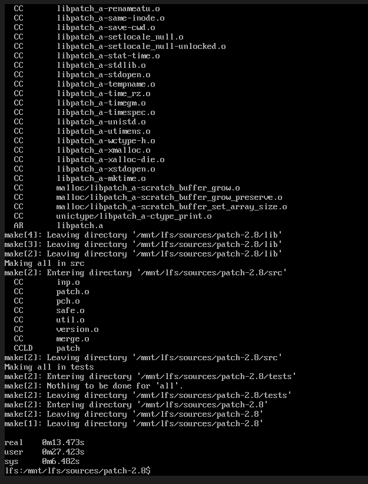
*Figura 1: patch make *

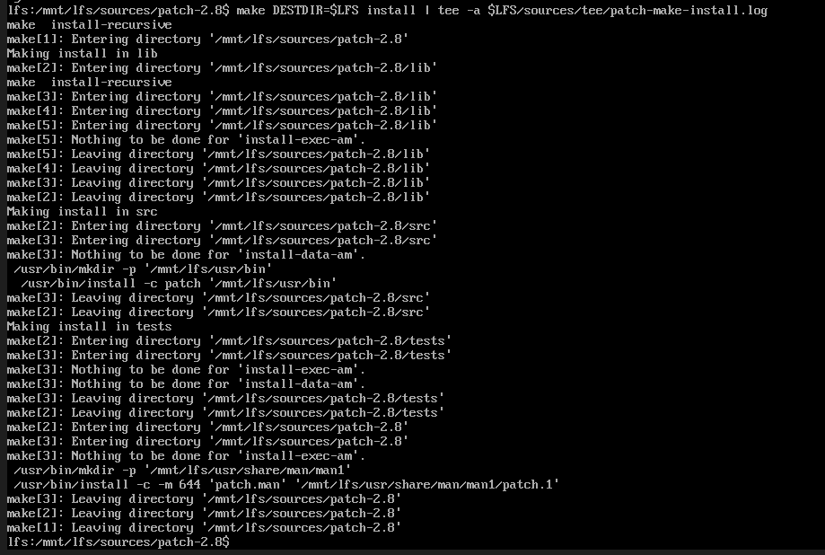
*Figura 2: patch make install*


*Figura 3: sed make*


*Figura 4: sed make install*


*Figura 5: tar make*


*Figura 6: tar make install*


*Figura 7: xz make*


*Figura 8: xz install*


*Figura 9: binutils make*


*Figura 10: binutils make install*

--- 

# Sesión 9: 5 de Diciembre - Cont 2 - Cross Compiling Temporary Tools

## Objetivo: Continuacion de la instalación de temporary tools necesarias para el entorno de cross-compilation (Gcc -pass 2)

## Tareas Realizadas

(12:45 - 14:03 )
 - 6.18 Gcc pass 2

## Comandos principales ejecutados:

#Descomprimir paquetes necesarios

tar -xf ../mpfr-4.2.2.tar.xz
mv -v mpfr-4.2.2 mpfr
tar -xf ../gmp-6.3.0.tar.xz
mv -v gmp-6.3.0 gmp
tar -xf ../mpc-1.3.1.tar.gz
mv -v mpc-1.3.1 mpc

#cambiar lib64 a lib en t-linux64

case $(uname -m) in
  x86_64)
    sed -e '/m64=/s/lib64/lib/' \
        -i.orig gcc/config/i386/t-linux64
  ;;
esac

#Habilitar posix supports con las librerías libgcc y libstdc++

sed '/thread_header =/s/@.*@/gthr-posix.h/' \
    -i libgcc/Makefile.in libstdc++-v3/include/Makefile.in

mkdir -v build
cd       build

#configuración para compilar

../configure 

make

make DESTDIR=$LFS install

ln -sv gcc $LFS/usr/bin/cc

## Resultados Obtenidos

#### Gcc- pass 2 - instalado

## Problemas Encontrados

Ningún problema significante.

## Evidencia


*Figura 1: Gcc pass 2 make *


*Figura 2: Gcc pass 2 make install*

----

# Sesión 10: 6 de Diciembre - Entrando Chroot y Construyendo Herramientas Temporales

## Objetivo: Preparar el entorno Chroot, configurar el sistema básico e instalar parte del Gettext final.

## Tareas Realizadas

(10:49 - 12:30 )
- 7.2 Cambiar el Ownership 
- 7.3 Preparar el sistema de archivos del Virtual Kernel
- 7.4 Entrar al entorno Chroot
- 7.5 Cear Directórios
- 7.6 Crear archivos esenciales y symbolic links

(12:30 - 13:17 )
- 7.7 Gettext-0.26 (Construcción e instalación)

## Comandos principales ejecutados:

#### 7.2 Cambiar de Owner, de lfs a root (como usuario root, fuera de $LFS)

chown --from lfs -R root:root $LFS/{usr,var,etc,tools}
case $(uname -m) in
  x86_64) chown --from lfs -R root:root $LFS/lib64 ;;
esac

#### 7.3 Preparar Sistemas de Archivos (como usuario root, fuera de $LFS)

mkdir -pv $LFS/{dev,proc,sys,run}
mount -v --bind /dev $LFS/dev
mount -vt devpts devpts -o gid=5,mode=0620 $LFS/dev/pts
mount -vt proc proc $LFS/proc
mount -vt sysfs sysfs $LFS/sys
mount -vt tmpfs tmpfs $LFS/run
if [ -h $LFS/dev/shm ]; then
  install -v -d -m 1777 $LFS$(realpath /dev/shm)
else
  mount -vt tmpfs -o nosuid,nodev tmpfs $LFS/dev/shm
fi

#### 7.4 Entrar al entorno Chroot con variables de entorno
chroot "$LFS" /usr/bin/env -i   \
   ….

#### 7.5 Creación de Directorios 
mkdir -pv /{boot,home,mnt,opt,srv}
... (comandos de mkdir -pv y install -dv)

##### 7.6 Archivos esenciales y symbolic links
ln -sv /proc/self/mounts /etc/mtab
cat > /etc/hosts << EOF ... (creación de hosts)
cat > /etc/passwd << "EOF" ... (creación de passwd)
cat > /etc/group << "EOF" ... (creación de group)
echo "tester:x:101:101::/home/tester:/bin/bash" >> /etc/passwd
echo "tester:x:101:" >> /etc/group
install -o tester -d /home/tester

#### Comenzar nueva shell para aplicar /etc/passwd
exec /usr/bin/bash --login

#### Inicializar logs
touch /var/log/{btmp,lastlog,faillog,wtmp}
chgrp -v utmp /var/log/lastlog
chmod -v 664  /var/log/lastlog
chmod -v 600  /var/log/btmp

#### 7.7 Gettext-0.26 

#### Dentro del directorio extraído

./configure --disable-shared

### Compilar

Make

#### Instalar lo necesario (mediante la función cp)

cp -v gettext-tools/src/{msgfmt,msgmerge,xgettext} /usr/bin

## Resultados Obtenidos

Entorno Chroot inicializado exitosamente, con el prompt mostrando root en lugar de "I have no name!".

Estructura de directorios FHS creada.

Archivos esenciales /etc/hosts, /etc/passwd y /etc/group creados.

Gettext-0.26 compilado y sus binarios esenciales  instalados 

Permite que los programas muestren mensajes en el idioma nativo del usuario mediante archivos de traducción separados del código fuente.

## Problemas Encontrados

Problema: Al comenzar el capítulo 7, se cambia el owner de lfs, del usuario lfs a root, pero en $LFS/sources yo cree una carpeta llamada tee donde guardo todos los make y make install de los paquetes compilados e instalados, y el usuario lfs es owner de esto. 

Causa: La carpeta fue creada mientras estaba en sesion con el usuario lfs

Solución: se usó el mismo comando que se usan para los directorios y archivos,pero adaptado para tee: chown --from lfs -R root:root $LFS/sources/tee

Problema: Por razón alguna, el sistema que en que se trabajaba se colgó.

Solución: Gracias a los snapshot, se pudo volver a comenzar desde la sesión anterior, perdiendo asi solo el trabajo del dia.

## Reflexiones Técnicas

Ahora se comienza el Capitulo 7 donde preparamos el sistema para entrar al Chroot, aislandonos completamente. Se crea un kernel virtual porque las aplicaciones de usuario las usan. Al entrar el chroot configuramos también las variables de entorno necesarias, este mismo se utiliza para instalar el sistema final. Después, se crea toda la estructura de directorios manualmente mediante comandos,Seguimos el Filesystem Hierarchy Standard, los directorios por predeterminado tienen el permiso modo 755, pero cambiamos estos permisos por seguridad a root (para que ningún usuario normal pueda entrar) y a dos directorios de archivos temporales(para que cualquiera puede escribir en dichos directorios ).
Se crean los archivos esenciales como hosts, passwd,group : de los cuales los dos últimos tienen lineas para que root pueda loguearse y que el nombre “root” sea reconocido.

Nota Despues del commit: No se crea el kernel virtual, se monta el kernel del build system en chroot para la comunicacion entre estos dos

## Evidencia


*Figura 1: Root owner de tee*


*Figura 2: Owner de directorios de LFS*


*Figura 3: Owner de directorios de LFS 2*


*Figura 4: Gettext make*

---

# Sesión 11: 7 de Diciembre - Instalacion de Paquetes - se subió a github un dia despues

## Objetivo: Continuar instalando los paquetes restantes del Capítulo 7 (Bison,Perl,Python,TexInfo,Util-Linux)

## Tareas Realizadas

(11:13 - 11:37 )
- Bison-3.8.2

(11:37 - 12:00 )
- Perl-5.42.0

(12:00 - 12:19 )
- Python-3.13.7

(12:19 - 12:33 )
- Texinfo-7.2

(12:33 - 12:57 )
- Util-linux-:2.41.1 

## Comandos principales ejecutados:

#### Bison-3.8.2

#Configuración para compilación

./configure --prefix=/usr \
            --docdir=/usr/share/doc/bison-3.8.2

#Compilar

make

#Instalar

make install

#### Perl-5.42.0

#Configuración para compilar

sh Configure -des     
                                    
#Compilar

make

#Instalar

make install

#### Python-3.13.7

#Configuración para compilar 

./configure --prefix=/usr       \
….
#Se prohíbe la instalación de librerías estáticas
#Se deshabilita el instalador de paquetes de Python
#También se prohíbe la librería estática libpython, que ocupa mucho espacio.

#Compilar

make

#Instalar

make install

#### Texinfo-7.2

#Configuración para compilar 

./configure --prefix=/usr

#Compilar

make

#Instalar

make install

#### Util-linux-2.41.1 

#### Segun FHS, se recomienda crear el directorio hwclock

mkdir -pv /var/lib/hwclock

#Configuración para compilar 

./configure --libdir=/usr/lib     \
…….

#/var/lib/hwclock/adjtime se crea aca por recomendacion del FHS (Jerarquía de archivos de sistema) y para que mas adelante no se cree en otro lugar
#Se previene warnings por paquetes no existentes o en LFS
#Deshabilita Python
 

#Compilar
make

#Instalar

make install

## Resultados Obtenidos

#### Bison-3.8.2 

Es un generador de parseadores de uso general.

#### Perl-5.42.0

Lenguaje de programación.

#### Python-3.13.7

Lenguaje de programación.

#### Texinfo-7.2

Es un sistema de documentación,permite crear documentación en múltiples formatos a partir de un archivo fuente.

#### Util-linux-2.41.1 

Contiene herramientas fundamentales para la administración del sistema, manejo de archivos, procesos, usuarios y dispositivos.

## Reflexiones Técnicas

En esta parte de la construcción usamos los paquetes instalados como parte de los temporary tools para construir lfs, y también los paquetes ya se instalan en sus directorios de destino final, donde van a estar implementados en lfs. Este es el capítulo final donde se comienza a dejar de depender del build system o del Rocky Linux, en este caso sería para la compilación de los próximos paquetes. Ya no se usa LFS_TGT (en realidad no tenemos más la variable de entorno asignada al entrar a chroot) porque ya no hace falta especificar para que system o sistema estamos construyendo, porque es sí mismo.
En el Capítulo 7 dejamos de hacer cross-compilation porque tenemos las herramientas básicas compiladas para el sistema final. Pero, se sigue dependiendo temporalmente del kernel de Rocky Linux para: la ejecución de todos los procesos (make, gcc, bash),la gestión de memoria y procesos,los drivers de hardware, el sistema de archivos en ejecución.
Más específico,se montan los virtual kernel filesystems del Rocky Linux dentro del chroot para que los programas en el chroot puedan comunicarse con el kernel de Rocky Linux que está en ejecución.
Esta dependencia del kernel de Rocky Linux es temporal y eventualmente se dejará de usar el kernel del build system.

## Evidencia


*Figura 1: bison make*


*Figura 2: bison make install*


*Figura 3: perl make*


*Figura 4: perl make install*


*Figura 5: python make*


*Figura 6: python make install*


*Figura 7: texinfo make*


*Figura 8: texinfo make install*


*Figura 9: util-linux-make*


*Figura 10: util linux make install*

---

# Sesión 12: 9 de Diciembre - Transición a Sistema Final y Glibc

## Objetivo: Comenzando el Capítulo 8

## Tareas Realizadas

(20:03 - 20:19 )
- Limpiar archivos no necesarios y realizar el Backup

(20:19 - 20:25 )
- Man-pages-6.15 

(20:25 - 20:28 )
- Iana-Etc-20250807 

(20:28 - 23:46 )
- Glibc-2.42 

## Comandos principales ejecutados:
#### Borrar archivos de documentación y archivos libtool
rm -rf /usr/share/{info,man,doc}/*
find /usr/{lib,libexec} -name \*.la -delete

#Remover tools 
rm -rf /tools

exit

#Desmontar todos los puntos

mountpoint -q $LFS/dev/shm && umount $LFS/dev/shm
umount $LFS/dev/pts
umount $LFS/{sys,proc,run,dev}

#### Hacer el Backup
cd $LFS
tar -cJpf $HOME/lfs-temp-tools-12.4-systemd.tar.xz .

####  Man-pages-6.15 

#Remover man-pages sobre hashing de contraseñas 

rm -v man3/crypt*

#Instalar

make -R GIT=false prefix=/usr install

#### Iana-Etc-20250807 

#Instalar copiando archivos a /etc

cp services protocols /etc

#### Glibc-2.42 

#Aplicar parche

patch -Np1 -i ../glibc-2.42-fhs-1.patch

#Segun el manual para BLFS
sed -e '/unistd.h/i #include <string.h>' 
    
mkdir -v build
cd       build

#utilidades ldconfig y sln instalados en /usr/sbin

echo "rootsbindir=/usr/sbin" > configparms

#Configuración para compilar

../configure --prefix=/usr                   

#Deshabilitar que warning paren la compilación
#Prevenir buffer overflow
#Deshabilitar cache daemon
#Usar la libreria correcta , no usar lib64,solo lib

#Compilar
time make

#Confirmar la compilación

time make check

#Para prevenir un warning

touch /etc/ld.so.conf

#Saltar sanity check viejo.

sed '/test-installation/s@$(PERL)@echo not running@' -i ../Makefile

#Instalar

make install

#Arreglar dirección 

sed '/RTLDLIST=/s@/usr@@g' -i /usr/bin/ldd

#instalar locales

localedef -i C -f UTF-8 C.UTF-8
……

#Cambia valores predeterminados del Glibc
cat > /etc/nsswitch.conf << "EOF"
…..

#Añadir datos sobre time zones(zonas horarias)

#Configurar dynamic loader para que busque librerías en varios directorios

cat > /etc/ld.so.conf << "EOF"
….

## Resultados Obtenidos

#### Man-pages-6.15 

Páginas de manual del sistema Linux 

#### Iana-Etc-20250807 

Archivos de configuración de red 

#### Glibc-2.42 

Biblioteca C mínima. Hace que GCC pueda crear programas que corran en LFS.

## Problemas Encontrados

problema: Se colgo mi maquina virtual al terminar de instalar glibc porque la pc utilizo demasiada memoria.

Solución: Se tuvo que comenzar de nuevo, y se aseguró de manejar mejor la memoria

Problema: La hora y fecha estaban mal al hacer tzselect para la zona horaria.

Solución: La decisión fue usar Asunción, aun con la hora incorrecta.

Problema: Hubo algunos problemas encontrados por check-make

Solución: Según el manual, están todos dentro del rango y algunos test fallan por varios motivos, timeout,cpu viejo, etc.

## Reflexiones Técnicas

Se comienza el capítulo 8, ahora se está construyendo ya los paquetes finales para el sistema.
En este capítulo el manual dice que prioriza la estabilidad de instalación y ejecución de dichos paquetes sobre el rendimiento marginal de la optimizaciones, que pueden causar errores en las toolchain críticas.
La compilación de Glibc es más rápida que la primera en el capítulo 5, sin embargo, al chequear con make check, tarda considerablemente más , pero se asegura de que glibc que es la biblioteca C principal del LFS. Cabe recalcar que el manual mismo dice que algunos tests fallen es normal ya que pueden ser por timeout, o simplemente librerias que tal vez no se necesiten.
El manual también indica que promueve a no instalar librerias estaticas, ya que si por ejemplo hay que remover una libreria por algun error de seguridad, cada programa que usa esa libreria estatica va a tener que volver a linkearse(re-enlazarse) con la nueva

## Evidencia


*Figura 1: man-pages install*


*Figura 2: iana-etc install*


*Figura 3: glibc make*


*Figura 4: glibc makecheck*


*Figura 5: glibc make install*


*Figura 5: fails de checkmake*

---

# Sesión 13: 10 de Diciembre - Instalación de Zlib,Bzip2,Xz,Lz4

## Objetivo: Instalar paquetes 

## Tareas Realizadas

(12:26 - 12:35 )
- Zlib-1.3.1

(12:35 - 12:51 )
- Bzip2-1.0.8

(12:51 - 13:07 )
- Xz-5.8.1

(13:07- 13:25 )
- Lz4-1.10.0

## Comandos principales ejecutados:

####
Para todos los make y make install se le añade  | tee -a nombre.log.

#### Zlib

#Configuración de compilacion

./configure --prefix=/usr
#Instalar en /usr

#Compilar
make

#Verificar que funciona
make check

#Los tests del make check dieron ok, por lo tanto se procede con la instalación

#Instalar

make install

#Remover librería estática

rm -fv /usr/lib/libz.a

####  Bzip2-1.0.8 

 #Aplicar parche

patch -Np1 -i ../bzip2-1.0.8-install_docs-1.patch

#Man pages en directorio correcto

sed -i "s@(PREFIX)/man@(PREFIX)/share/man@g" Makefile

#Configuración de compilación

make -f Makefile-libbz2_so
make clean
#Usar makefile específico Makefile-libbz2_so

#Compilar

make

#Instalar

make PREFIX=/usr install

#Instalar librerias compartidas

cp -av libbz2.so.* /usr/lib
ln -sv libbz2.so.1.0.8 /usr/lib/libbz2.so

#Instalar el binario compartido en el directorio /usr/bin, y las copas de bzip2 se linkea con symbolic links.

cp -v bzip2-shared /usr/bin/bzip2
for i in /usr/bin/{bzcat,bunzip2}; do
  ln -sfv bzip2 $i
done

#Remover librería estática

rm -fv /usr/lib/libbz2.a

#### Xz-5.8.1

#Configurar la compilación

./configure --prefix=/usr    \
            --disable-static \
            --docdir=/usr/share/doc/xz-5.8.1
#Instalar en /usr
#Deshabilitar librerías estáticas
#documentación en /usr/share/doc/xz-5.8.1

#Compilar

make

#Verificar instalación

make check

#Instalar

make install

#### Lz4-1.10.0 

#Compilar

make BUILD_STATIC=no PREFIX=/usr

#Verificar compilación

make -j1 check

#Instalación

make BUILD_STATIC=no PREFIX=/usr install

## Resultados Obtenidos

#### Zlib-1.3.1 - instalado
Librería de compresión usada por muchos programas y formatos.

#### Bzip2-1.0.8  - instalado

Programa para comprimir que usa el algoritmo Burrows-Wheeler, más rápido de xz.

#### Xz-5.8.1  - instalado

Programa para comprimir que usa el algoritmo LZMA2 para una compresión muy alta, generando archivos .xz. más lento que Bzip2

#### Lz4-1.10.0  - instalado

Programa para comprimir, sin pérdida alguna extremadamente rápido, particularmente bueno para aplicaciones en tiempo real.

## Reflexiones Técnicas
Instalación de pequeños paquetes, el make heck de Lz4 no es particularmente descriptivo entonces se chequeo con lz4 –version, si funciona, y con [ echo “hola” | lz4 > test.lz4 ], para comprimir un archivo y[ lz4 -d test.lz4 ], descomprimir y verificar test que efectivamente dice hola.Esta pequeña prueba fue hecha junto a inteligencia artificial.
Se deshabilitan varias librerías estáticas.
Se instalaron varios programas de compresión, demostrando que cada uno tiene una especialización o particularidad , xz alta compresión, bzip2 más equilibrado en compresión y velocidad, lz4 velocidad muy rápida.

## Evidencia


*Figura 1: zlib make*


*Figura 1: zlib make check*


*Figura 1: zlib make install*


*Figura 1:bzip2-make*


*Figura 1: bzip2-make install*


*Figura 1: bzip2 make install libreria compartida binario en usr bin*


*Figura 1: xz-make*


*Figura 1: xz make check*


*Figura 1: xz make install*


*Figura 1: lz4-make-install*


*Figura 1: lz4-checkeo-rapido*

---

# Sesión 14: 11 de Diciembre - Instalación de Zstd,File,Readline,M4 - Subido un dia despues en github

## Objetivo: Instalar paquetes 

## Tareas Realizadas

(16:11 - 16:25 )
- Zstd-1.5.7 

(16:27 -  16:34 )
- File-5.46 

(16:34 - 16:51 )
- Readline-8.3 

(16:51- 17:01 )
- M4-1.4.20 

## Comandos principales ejecutados:

#### Generalmente al make se le agregar time, y a make, make install se les agrega | tee -a “nombre-del.log”

#### Zstd-1.5.7 

#Compilar 

make prefix=/usr

#Revisar si funciona correctamente

make check

#Instalar paquete

make prefix=/usr install

#Eliminar librería estática

rm -v /usr/lib/libzstd.a

####  File-5.46 

#Configurar para compilar

./configure --prefix=/usr

#Compilar

make

#Revisar resultado

make check

#Instalar

make install
 
####  Readline-8.3 

#Configurar la compilación

#Evitar problemas al reinstalar Readline

sed -i '/MV.*old/d' Makefile.in
sed -i '/{OLDSUFF}/c:' support/shlib-install

#Prevenir rpath en las librerias compartidas

sed -i 's/-Wl,-rpath,[^ ]*//' support/shobj-conf

#Configuración para compilar

./configure --prefix=/usr    \
….
#Deshabilita librerías estáticas
#Explícitamente establece dirección de la documentación
#Establecer que las funciones de librerías termcap puede encontrarse en las librerías de curses

#Compilar 

make SHLIB_LIBS="-lncursesw"
#Opcion que obliga a Readline enlazarse con la libreria libncursesw

#Instalar

make install

#Instalar documentación

install -v -m644 doc/*.{ps,pdf,html,dvi} /usr/share/doc/readline-8.3

#### M4-1.4.20 

#Configuración para compilar

./configure --prefix=/usr

#Compilar

make 

#Verificar compilación

make check

#Instalación

make install

## Resultados Obtenidos

####  Zstd-1.5.7  - instalado
Programa para comprimir,concibe alta compresión.

#### File-5.46   - instalado

Contiene utilidad que permite identificar el tipo de archivos, o de múltiples archivos

#### Readline-8.3  - instalado

Es una librería que tiene capacidades de edición y manejo de líneas de comandos para programas interactivos.

#### M4-1.4.20   - instalado

Procesador de macros. 

## Reflexión Técnica

Se noto un paquete (Zstd) que se compila con “make prefix=/usr” e instala con “make prefix=/usr install”, por lo que se entiende, al compilar, en vez de usar configure, durante la compilación se le dice al programa que va a ser instalado en /usr. Durante la instalación se le instala en la dirección /usr con el mismo comando prefix, si el comando sólo está durante la instalación y no compilacion , entonces al compilar puede tener otro destino que /usr, haciendo que al instalar no encuentre los archivos en /usr donde queremos instalar. En otras palabras, puede haber una disparidad de lo que el compilador piensa dónde se va a instalar, y en donde se quiere realmente instalar, por eso no es redundante usar prefix=/usr para la compilación e instalación en este caso.

## Evidencia


*Figura 1: file-make*


*Figura 2: file-make check*


*Figura 3: zstd make install*


*Figura 4: file-make*


*Figura 5: file-make check*


*Figura 6: file-make install*


*Figura 7:bzip2-make*


*Figura 8: readline-make install*

*Figura 9: file-make*


*Figura 10: file-make check*


*Figura 11: zstd make install*

---

# Sesión 15: 13 de Diciembre - Instalación de Bc,Flex,Tcl 

## Objetivo: Instalar paquetes 

## Tareas Realizadas

(10:19 - 10:30 )
- Bc-7.0.3 

(10:30 -  10:43)
- Flex-2.6.4 

(10:43 - 11:25 )
- Tcl-8.6.16  

## Comandos principales ejecutados:

#### Generalmente al make se le agregar time, y a make, make install se les agrega | tee -a “nombre-del.log”

#### Bc-7.0.3 

#Configurar para compilar

CC='gcc -std=c99' ./configure --prefix=/usr -G -O3 -r

#Se especifica el compilador y 
#Omitir partes del test suite hasta que se instalen
#Habilitar opción de optimización
#Habilitar Readline para mejorar edición de líneas

#Compilar

make

#Ejecutar test o prueba

make test

#Instalar

make install

####  Flex-2.6.4 

#Configurar para compilar

./configure --prefix=/usr \

#Instalar en /usr
#Deshabilitar librerías estáticas
#Establecer dirección absoluta de documentación

#Compilar

make

#Revisar resultado

make check

#Instalar

make install

#Symbolic links para que programas no usen el predecesor de flex (lex)

ln -sv flex   /usr/bin/lex
ln -sv flex.1 /usr/share/man/man1/lex.1

 
####  Tcl-8.6.16  

#Configuración para compilar

SRCDIR=$(pwd)
cd unix
./configure --prefix=/usr           \
….
#Instalar en /usr
#Establecer dirección para los man-pages
#Deshabilitar-path,puede causar problemas

#Compilar 

make

-sed ….

-sed …..

-sed …..
unset SRCDIR

Los comandos sed previous,remueven referencias al directorio que usamos para crear el archivo de configuración y los reemplaza por el directorio de instalación (/usr)

#Testear la compilación
make test

#Instalar

make install 
chmod 644 /usr/lib/libtclstub8.6.a

#Permiso para poder escribir en la librería

chmod -v u+w /usr/lib/libtcl8.6.so

#Instalar Headers

make install-private-headers

#Symbolic link necesario y renombrar un man-page

ln -sfv tclsh8.6 /usr/bin/tclsh
mv /usr/share/man/man3/{Thread,Tcl_Thread}.3

## Problemas Encontrados

Problema: El make test de tcl dio una falla de async.test

Solución: Al investigar.Se decidió ignorar la falla ya que no es usado por LFS, Expect o DejaGNU. 

## Resultados Obtenidos

####  Bc-7.0.3  - instalado
Contiene un lenguaje de procesador numérico

#### Flex-2.6.4    - instalado

Contiene utilidad para crear programas que reconozcan patrones de texto.

#### Tcl-8.6.16   - instalado

Tool Command Language, es un lenguaje de scripting de propósito general.útil para automatización y pruebas de aplicaciones.

## Reflexión Técnica

En tcl , por si algún paquete que se instale despues, se usa comandos sed, para reemplazar la referencia de el directorio donde se construyó, a el directorio de instalación. Esto se hace por si un paquete necesita usar tcl en el futuro.
El uso principal de Tcl es para ejecutar el test suite de Binutils,Gcc y otros paquetes para probar que la funcionalidad estos es correcta.

## Evidencia


*Figura 1: bc-make*

*Figura 2: bc-make test*


*Figura 3: bc-make install*


*Figura 4: flex-make*

*Figura 5: flex-make check*


*Figura 6: flex-make install*


*Figura 7: tcl-make*


*Figura 8: tcl-make test*


*Figura 9: tcl-make install*

---

# Sesión 16: 14 de Diciembre - Instalación de Expect,DejaGNU,Pkgconf,Binutils

## Objetivo: Instalar paquetes 

## Tareas Realizadas

(11:33 - 10:47 )
- Expect-5.45.4

(11:47 -  12:08)
- DejaGNU-1.6.3 

(12:08 - 12:18 )
-  Pkgconf-2.5.1  

(12:18 - 13:15 )
-  Binutils-2.45

## Comandos principales ejecutados:

#### Generalmente al make se le agregar time, y a make, make install se les agrega | tee -a “nombre-del.log”

### Se extrae con tar -xf nombre-paquete, y elimina el directorio al terminar con rm -rf nombre-paquete

### Expect-5.45.4

#Verificar que dependencia que funcione

python3 -c 'from pty import spawn; spawn(["echo", "ok"])'

#Aplicar parche

patch -Np1 -i ../expect-5.45.4-gcc15-1.patch

#Configuracion para compilar

./configure --prefix=/usr           \
……

#Instalar en /usr 

#Avisa al compilador en que directorio esta tclConfig.sh

#Avisa al compilador dónde encontrar los headers de Tcl

#Deshabilitar-path

#Habilitar construction de librerías compartidas

#Específica directorio de man-pages

#Compilar

make

#Ejecutar test o prueba

make test

#Instalar

make install
ln -svf expect5.45.4/libexpect5.45.4.so /usr/lib

###  DejaGNU-1.6.3 

#Crear directorio para construir

mkdir -v build
cd       build

#Configurar para compilar

../configure --prefix=/usr
makeinfo --html --no-split -o doc/dejagnu.html ../doc/dejagnu.texi
makeinfo --plaintext       -o doc/dejagnu.txt  ../doc/dejagnu.texi

#Revisar resultado

make check

#Instalar

make install
install -v -dm755  /usr/share/doc/dejagnu-1.6.3
install -v -m644   doc/dejagnu.{html,txt} /usr/share/doc/dejagnu-1.6.3

 
###  Pkgconf-2.5.1 

#Configuración para compilar

./configure --prefix=/usr    \
….

#Instalar en /usr
#Deshabilitar librerías estáticas
#Establecer directorio para documentación

#Compilar 

make

#Instalar

make install 

#Symbolic links para mantener compatibilidad

ln -sv pkgconf   /usr/bin/pkg-config
ln -sv pkgconf.1 /usr/share/man/man1/pkg-config.1

###  Binutils-2.45

#Crear directorio para construir

mkdir -v build
cd       build

#Configuracions para compilar

../configure --prefix=/usr       \
……

#Instalar en /usr

#Habilitar soporte de plugins para linker

#Archivos de configuracion instalados en /etc

#Habilitar librerias compartidas

#Habilitar soporte para 64 bit

#Establece el hash predeterminado como GNU

#Compilar

make tooldir=/usr

#Verificar compilación

make -k check
grep '^FAIL:' $(find -name '*.log')

#Instalar

make tooldir=/usr install

#Remover librerías estáticas y archivos innecesarios

rm -rfv /usr/lib/lib{bfd,ctf,ctf-nobfd,gprofng,opcodes,sframe}.a \
        /usr/share/doc/gprofng/

## Resultados Obtenidos

####  Expect-5.45.4  - instalado

Contiene herramientas de automatizacion, se usa tambien para probar test suites criticos

#### DejaGNU-1.6.3     - instalado

Contiene framework para ejecutar test suites en GNU tools.

#### Pkgconf-2.5.1   - instalado

Para gestionar flags de compilación y enlace de bibliotecas.

#### Binutils-2.45  - instalado

Un conjunto de herramientas esenciales para crear, manipular y analizar archivos binarios, incluyendo el ensamblador y el enlazador.

## Problemas encontrados

Problema:Binutils make-check terminó con un error 2 ,esto se volvió preocupante

Solución: Se investigó con ayuda de la inteligencia artificial,que informa que si existe algún untested test este make check termina con error. También el comando del manual grep '^FAIL:' $(find -name '*.log'), que no imprime nada en absoluto, se dedujo que todo funciona correctamente

Problema: Al escribir el config del Pkgconf , se escribió mal , se puso enabled-static que es exactamente lo opuesto que se espera.

Solución: Como no se llegó a compilar, se retorno al directorio /sources y se ejecuto el comando rm -rf pkgconf-2.5.1, y se comenzo de vuelta a instalar este paquete.

## Reflexión Técnica

Muchos warnings al compilar Expect , sin embargo en el make test pasaron todos los tests.
Algunos make check , como el de dejagnu , son algo difíciles de interpretar porque dice # of expected passes 300, que se interpreta como la cantidad de tests que se esperan que pasen, pero al parecer , esto está reportando que efectivamente pasaron las 300 pruebas, al investigar con inteligencia artificial el porqué puede pasar esto , explica que como dejagnu es relativamente antiguo (de 1990), los contadores se expresan en base al resultado de categoria,no la intención.
El make check de binutils es crítico para garantizar la estabilidad y funcionamiento del sistema final, el manual prácticamente obliga al usuario hacer este paso.
En este último paquete instalado comenzamos a usar expect ,dejagnu y tcl para las pruebas del make-check de binutils, confirmando tanto binutils como los paquetes para pruebas.

## Evidencia


*Figura 1: expect make*


*Figura 2: expect make test*


*Figura 3: expect make install*


*Figura 4: dejagnu make check*


*Figura 5: dejagnu make install*


*Figura 6: pkgconf make*


*Figura 7: pkgconf make install*


*Figura 8: binutils-make*


*Figura 9: binutils make check*


*Figura 10: binutils make check 2*


*Figura 11: binutils-make install*

---

# Sesión 17: 15 de Diciembre - Instalación de Gmp,MPFR,MPC y Attr

## Objetivo: Instalar paquetes 

## Tareas Realizadas

(10:48 - 11:04 )
- GMP-6.3.0 

(11:04 -  11:25)
- MPFR-4.2.2  

(11:25 - 11:36 )
-  MPC-1.3.1  

(11:36 - 12:05 )
-  Attr-2.5.2 

## Comandos principales ejecutados:

#### Generalmente al make se le agregar time, y a make, make install se les agrega 2>&1 | tee -a “nombre-del.log”

### Se empezó a agregar 2>&1,  para redirigir stderr a stdout y que escriba en los archivos creados por tee.

### Se extrae con tar -xf nombre-paquete, y elimina el directorio al terminar con rm -rf nombre-paquete

### GMP-6.3.0 

#Compatibilidad para gcc 

sed -i '/long long t1;/,+1s/()/(...)/' configure

#Configuración para compilar

./configure --prefix=/usr    \

#Instalar en /usr

#Habilitar C++

#Deshabilitar librerías estáticas

#Establecer directorio para documentación

#Compilar

make
make html

#Verificar compilacion correcta

make check 2>&1 | tee gmp-check-log
awk '/# PASS:/{total+=$3} ; END{print total}' gmp-check-log

#Instalar 

make install
make install-html

###  MPFR-4.2.2 

#Configurar para compilar

../configure --prefix=/usr
…
#Instalar en /usr

#Habilitar soporte multi-hilos para que las librerías o funciones no se corrompan

#Deshabilitar librerías estáticas

#Establecer directorio para documentación

#Compilar

make
make html

#Revisar compilacion

make check

#Instalar

make install
make install-html

 
###  MPC-1.3.1

#Configuración para compilar

./configure --prefix=/usr    \
….

#Instalar en /usr

#Deshabilitar librerías estáticas

#Establecer directorio para documentación

#Compilar

make
make html

#Revisar compilación

make check

#Instalar

make install
make install-html

###  Attr-2.5.2 

#Configuraciones para compilar

../configure --prefix=/usr       \
……

#Instalar en /usr

#Establecer /etc para archivos de configuraciones

#Deshabilitar librerías estáticas

#Establecer directorio para documentación

#Compilar

make

#Verificar compilación correcta

make check

#Instalar

make install

## Resultados Obtenidos

####  GMP-6.3.0   - instalado

Librería matemática de precisión arbitraria para cálculos con enteros, racionales y números de punto flotante grandes.

#### MPFR-4.2.2 - instalado

Librería para cálculos en coma flotante con precisión arbitraria y redondeo correcto, basada en GMP.

#### MPC-1.3.1   - instalado

Librería para aritmética de números complejos con precisión arbitraria, basada en MPFR y GMP.

####  Attr-2.5.2   - instalado

Contiene utilidades para manejar atributos extendidos (metadatos) en sistemas de archivos.

## Problemas encontrados

Problema:En la instalacion del paquete MPFR, Se ejecuto el comando make install-html antes del make check.

Solución: Por suerte, esto es solo la documentacion en un archivo html y no complica o influye en el funcionamiento del programa,entonces, se decidió seguir adelante

Problema: Attr make-check devolvió un fail para getfattr.test

Solución: Con ayuda de inteligencia artificial se uso este codigo para confirmar que funciona correctamente:

echo "test" > testfile.txt

#Intentar establecer un atributo extendido

setfattr -n user.comment -v "Este es un comentario" testfile.txt

#Leer el atributo

getfattr -n user.comment testfile.txt

output:#file: testfile.txt user.commet="Este es un comentario"

## Reflexión Técnica

Varios tests de varios paquetes se esperan que falle, si el manual no dice explícitamente que el paquete es crítico y que necesita si o si un número mínimo de passes, lo más probable es que algún test falle o se salte.
En el paquete gmp nos pide ejecutar el codigo ABI=32 ./configure …, si el sistema es de arquitectura 32 bit, como es de 64-bit , este comando se ignoró.
LLamo la atencion varios paquetes con documentacion html, despues de investigar un poco con ayuda de la inteligencia artificial, esto tiene sentido, ya que es altamente portable, ligero, soporta links internos dentro del archivo mismo,no requiere muchos recursos,buen formateado (Si el creador del .html lo desea), puede abrirse en cualquier navegador en cualquier sistema.

## Evidencia


*Figura 1: gmp-make*


*Figura 2: gmp make install*


*Figura 3: gmp make install*


*Figura 4: mpfr-make*


*Figura 5: mpfr make check*


*Figura 6: mpfr make install*


*Figura 7: mpc-make*


*Figura 8: mpc make check*


*Figura 9: mpc make install*


*Figura 10: attr make *


*Figura 11: attr make check*


*Figura 12: attr make install*

*Figura 13: attr solucion*

---

# Sesión 18: 16 de Diciembre - Instalación de Acl,Libcap,Libxcrypt,Shadow

## Objetivo: Instalar paquetes 

## Tareas Realizadas

(10:23 - 10:37 )
- Acl-2.3.2 

(10:37 -  10:45)
- Libcap-2.76   

(10:45 - 10:58 )
-  Libxcrypt-4.4.38   

(10:58 - 11:20 )
-  Shadow-4.18.0  

## Comandos principales ejecutados:

#### Generalmente al make se le agregar time, y a make, make install se les agrega 2>&1 | tee -a “nombre-del.log”

### Se empezó a agregar 2>&1,  para redirigir stderr a stdout y que escriba en los archivos creados por tee.

### Se extrae con tar -xf nombre-paquete, y elimina el directorio al terminar con rm -rf nombre-paquete

### Acl-2.3.2  

#Configuración para compilar

./configure --prefix=/usr    \

#Instalar en /usr

#Deshabilitar librerías estáticas

#Establecer directorio para documentación

#Compilar

make

#Verificar compilación correcta

make check 

#Instalar 

make install

###  Libcap-2.76 

#Evitar que librerias estaticas sean instaladas

sed -i '/install -m.*STA/d' libcap/Makefile

#Compilar

make prefix=/usr lib=lib

#Revisar compilación

make test

#Instalar

make prefix=/usr lib=lib install

### Libxcrypt-4.4.38 

#Configuracion para compilar

./configure --prefix=/usr \
....

#Instalar en /usr

#Deshabilitar librerías estáticas

#Deshabilitar API obsoleto

#Contruir algoritmos de hash robustos(seguros)

#Compilar

make 

#Revisar compilación

make check

#Instalar

make  install

 
### Shadow-4.18.0 

#Deshabilitar la instalación del programa groups y sus man pages respectivos

sed -i 's/groups$(EXEEXT) //' src/Makefile.in
find man -name Makefile.in -exec sed -i 's/groups\.1 / /'   {} \;
find man -name Makefile.in -exec sed -i 's/getspnam\.3 / /' {} \;
find man -name Makefile.in -exec sed -i 's/passwd\.5 / /'   {} \;

#Cambiar metodo de encryption de crypt a Yescrypt, es mas seguro

sed -e 's:#ENCRYPT_METHOD DES:ENCRYPT_METHOD YESCRYPT:' \
…….
……..

#Configuración para compilar

touch /usr/bin/passwd    #Archivo necesita existir previo a instalacion, o puede instalarse en ruta incorrecta

./configure --sysconfdir=/etc   \
…..
….

#Instalar en /usr

#Deshabilitar librerías estáticas

#Habilitar bcrypt y Yescrypt

#Establecer máximo número de caracteres para contraseña (32)

#Deshabilitar libbsd,LFS no lo tiene

#Compilar

make

#Revisar compilación

make check

#Instalar

make exec_prefix=/usr install
make -C man install-man

### Configuración de Shadow

#Habilitar encubrimiento de contraseñas (también de group contraseña)

pwconv   
grpconv

#Directorio para configuración de la función useradd

mkdir -p /etc/default

#Configuración del comportamiento de usueradd

useradd -D --gid 999

#-D afecta los valores predeterminados

#Nuevos usuarios obtienen el group ID 999 , a menos de que se especifique lo contrario

## Resultados Obtenidos

####  Acl-2.3.2    - instalado

Permite dar acceso específico a usuarios o grupos, además de los permisos normales.

#### Libcap-2.76 - instalado

Permite dar privilegios específicos de root a programas sin darles acceso total.

#### Libxcrypt-4.4.38    - instalado

Librería con métodos de encriptación modernos (como Yescrypt) para hacer contraseñas seguras.

####  Shadow-4.18.0   - instalado

Maneja las contraseñas de usuarios en archivos ocultos separados de la información pública de los usuarios.

## Problemas encontrados

Problema:Acl make-check obtuvo XFAIL = 2, no se sabía si era bueno o malo

Solución:XFAIL significa que está anticipado a que falle, entonces se puede ignorar, y el fallo obtenido como FAIL, el manual lo espera, entonces se siguió adelante.

Problema: Al final de la configuración de shadow se ejecuta :passwd root, se ingresó una contraseña innecesariamente larga y se quería reemplazar.

Solución: Por suerte ,con ayuda de la inteligencia artificial se llego a la conclusión de que , ejecutando de nuevo el comando, e ingresando la nueva contraseña, esta se sobreescribe.
Confirmando con grep ‘^root’ /etc/shadow muestran hash diferentes.

## Reflexión Técnica

El paquete shadow que se encarga de manejar contraseñas, reemplaza el método de encriptación predeterminado por Yescrypt , que es más seguro, soporta mas de 8 caracteres,en ataques de brute-force crypt is mucho posible de desencriptar, en cambio, Yescrypt, aunque posible, tardaria multiple años , sino multiple décadas.
En el manual , el comando,useradd -D --gid 999, no se explico en profundidad, pero al investigar junto a la inteligencia artificial, esto es conveniente para que los usuarios puedan fácilmente compartir archivos, y para manipular en masa , muchos privilegios de multiples usuarios facilmente en un archivo o directorio.
En libxcrypt se ignoró la nota que permite habilitar el api obsoleto, ya que se sigue el manual y no existe paquete que lo necesite.

## Evidencia


*Figura 1: acl-make*


*Figura 2: acl make check*


*Figura 3: acl make install*


*Figura 4: libcap-make*


*Figura 5: libcap make test*


*Figura 6: libcap make install*


*Figura 7: libxcrypt-make*

*Figura 8: libxcrypt-make*


*Figura 9: libxcrypt-makelibxcrypt-make*

*Figura 10: shadow-make*


*Figura 11: shadow-make*


*Figura 12: passwd_prueba_hash*

---

# Sesión 19: 17 y 18 de Diciembre - Instalación de GCC

## Objetivo: Instalar paquete 

## Tareas Realizadas

(11:33 - 19:55) 17 de Diciembre
- GCC make y make check

(11:49 - 12:10)18 de Diciembre
- GCC make install hasta sanity checks

## Comandos principales ejecutados:

#### Generalmente al make se le agregar time, y a make, make install se les agrega 2>&1 | tee -a “nombre-del.log”

### Se empezó a agregar 2>&1,  para redirigir stderr a stdout y que escriba en los archivos creados por tee.

### Se extrae con tar -xf nombre-paquete, y elimina el directorio al terminar con rm -rf nombre-paquete

### GCC-15.2.0 

#Adaptar lib para la arquitectura, en vez de lib64, solo lib

case $(uname -m) in
  x86_64)
…..

#Crear directorio para la construcción

mkdir -v build
cd       build

#Configuración para compilar

../configure --prefix=/usr            \
……

#Instalar en /usr

#Utilizar el linker ld que se instaló previamente con el paquete BinUtils

#Deshabilitar disable-fixincludes, puede corromper archivos instalados, no es necesario para linux modernos.

#Habilita Los lenguajes C y C++ en GCC

#Deshabilita soporte para múltiples arquitecturas de librerías

#Usar libreria zlib instalada previamente

#Deshabilita bootstrap, triple compilación para confirmar funcionamiento correcto,pero toma más tiempo.

#Medidas de seguridad como, evitar y detectar, desbordamiento de pila,mover las direcciones de los programas ejecutables y herramientas de compilador, cada vez que se corre uno de los programas

#Compilar

make

#Para evitar limitación del tamaño de la pila (stack)

ulimit -s -H unlimited

#Remover test que si o si fallan

sed -e '/cpython/d' -i ../gcc/testsuite/gcc.dg/plugin/plugin.exp

#Verificar compilacion correcta

chown -R tester .
su tester -c "PATH=$PATH make -k check"

#Leer el resultado de los tests de make check

../contrib/test_summary

#Instalar 

make install

#Cambiar owner de testar a root

chown -v -R root:root \
    /usr/lib/gcc/$(gcc -dumpmachine)/15.2.0/include{,-fixed}

#Symbolic links necesarios

ln -svr /usr/bin/cpp /usr/lib
ln -sv gcc.1 /usr/share/man/man1/cc.1
ln -sfv ../../libexec/gcc/$(gcc -dumpmachine)/15.2.0/liblto_plugin.so \
        /usr/lib/bfd-plugins/

### Sanity check

#Verificar funcionamiento correcto de la compilación y el linker

echo 'int main(){}' | cc -x c - -v -Wl,--verbose &> dummy.log
readelf -l a.out | grep ': /lib'

#Verificar los 3 archivos crt*.o existen en /usr/lib

grep -E -o '/usr/lib.*/S?crt[1in].*succeeded' dummy.log

#Compilador detecta archivos de header correctos

grep -B4 '^ /usr/include' dummy.log

#Uso correcto del linker con las direcciones de busquedas correctas

grep 'SEARCH.*/usr/lib' dummy.log |sed 's|; |\n|g'

#Utilizar libc correcto

grep "/lib.*/libc.so.6 " dummy.log

#Utilizar dynamic linker correcto

grep found dummy.log

#Borrar archivos para los sanity check

rm -v a.out dummy.log

#Mover archivo a dirección correcta

mkdir -pv /usr/share/gdb/auto-load/usr/lib
mv -v /usr/lib/*gdb.py /usr/share/gdb/auto-load/usr/lib

### Problema Encontrado

Problema: El make check dio fallas que no eran partes de las esperadas, se decidio revisar.

Solución: Gracias a la inteligencia artificial, se ayudó a deducir que los fails no son completamente inesperados. Usando los comandos : 
grep -B 5 "^FAIL:" gcc/testsuite/gcc/gcc.log | head -50
grep -B 5 "^FAIL:" x86_64-pc-linux-gnu/libstdc++-v3/testsuite/libstdc++.log | head -50,
y se confirmó que no eran errores graves o críticos.

## Resultados Obtenidos

####  GCC - Instalado

## Reflexión Técnica

La compilación del Gcc tomo 52 minutos, lo cual es uno de los paquetes más lentos  de instalar, sin embargo, el make check tomó más de 7 horas (8 y media aprox), esto asegura de que no haya ni una falla inesperada en lo absoluto cuanto a Gcc resulta.
Se inspeccionaron los tests que fallaron y según el manual los tests relacionados con pr90579,suelen fallan,entonces se decidió ignorarlos y seguir adelante.
Todos los sanity checks cumplieron como se esperaba.

## Evidencia


*Figura 1: gcc-make*


*Figura 2: gcc-make*


*Figura 3: gcc-make-install*


*Figura 4: sanity-checks*

---

# Sesión 20: 19 de Diciembre - Instalación de Ncurses,Sed,Psmisc,Gettext

## Objetivo: Instalar paquetes 

## Tareas Realizadas

(10:41 - 11:09) 
- Ncurses-6.5-20250809 

(11:09 - 11:21) 
- Sed-4.9 

(11:21 - 11:27) 
- Psmisc-23.7 

(11:27- 12:21) 
- Gettext-0.26 

## Comandos principales ejecutados:

### Generalmente al make se le agregar time, y a make, make install se les agrega 2>&1 | tee -a “nombre-del.log”

### Se empezó a agregar 2>&1,  para redirigir stderr a stdout y que escriba en los archivos creados por tee.

### Se extrae con tar -xf nombre-paquete, y elimina el directorio al terminar con rm -rf nombre-paquete

###  Ncurses-6.5-20250809 

#Configuración para compilar

../configure --prefix=/usr   \
……

#Instalar en /usr

#Instalar librerías compartidas de C,prevenir instalación de librerías estáticas de C

#Prevenir instalar librerías para debug,Instalar librerías compartidas de C++

#Instalar pkg-config en directorio designado,instalar archivos .pc para pkg-config

#Compilar

make

#Instalar 

make DESTDIR=$PWD/dest install

#Lidiar con sobre-escritura de libncursesw.so.6.5 

install..
rm …
sed …
ln …

#Truco de linkear wide-characters con non-wide-characters

ln -sfv lib${lib}w.so /usr/lib/lib${lib}.so
ln -sfv ${lib}w.pc    /usr/lib/pkgconfig/${lib}.pc

#Symbolic link para aplicaciones que busquen -lcurses

ln -sfv libncursesw.so /usr/lib/libcurses.so

###  Sed-4.9 

#Configuración para compilar

./configure --prefix=/usr

#Compilar, y generar archivos html

make
make html

#Verificar el funcionamiento mediante make check

chown -R tester .
su tester -c "PATH=$PATH make check"

#Instalar paquete y documentación

make install
install -d -m755           /usr/share/doc/sed-4.9
install -m644 doc/sed.html /usr/share/doc/sed-4.9

### Psmisc-23.7 

#Configuración para compilar

./configure --prefix=/usr

#Compilar

make

#Verificar que se haya compilado correctamente

make check

#Instalar

make install

### Gettext-0.26 

#Configuración para compilar

./configure --prefix=/usr  \
            --disable-static \
            --docdir=/usr/share/doc/gettext-0.26

#Compilar

make

#Verificar que se haya compilado correctamente

make check

#Instalar

make install
chmod -v 0755 /usr/lib/preloadable_libintl.so

## Resultados Obtenidos

####  Ncurses-6.5-20250809 - Instalado

Librerías para manejo independiente de terminales de pantalla de caracteres.

#### Sed-4.9 - Instalado

Procesador de texto por líneas que usa un lenguaje de scripting para transformar datos de entrada.

#### Psmisc-23.7 - Instalado

Utilidades para monitoreo de procesos.

#### Gettext-0.26 - Instalado

Herramientas para internacionalización y localización de software.

## Reflexión Técnica

Ncurses no tiene make check dedicado, sino que los tests que se hacen para verificar su funcionamiento están en el directorio /test dentro del paquete extraído, y este se hace después de instalación, ya que es un paquete crítico pero muy estable al compilar.
El sed, como varios paquetes, utiliza el usuario tester para los tests, al investigar, esto se debe a que, si hay algún bug como root, esto puede alterar algo crítico o importante y afectar toda la instalación. También sirve para verificar y testear privilegios sobre archivos que no tenga autoridad.

## Evidencia


*Figura 1: ncurses make install*


*Figura 2: ncurses make install*

*Figura 3: sed-make*


*Figura 4: sed make check*


*Figura 5: sed make install*


*Figura 6: psmisc make*


*Figura 7: psmisc make install*


*Figura 8: gettext-make*


*Figura 9: gettext make check*


*Figura 10: gettext make install*

---

# Sesión 21: 20 de Diciembre - Instalación de Bison,Grep,Bash,Libtools

## Objetivo: Instalar paquetes 

## Tareas Realizadas

(09:41 - 10:25) 
- Bison-3.8.2 

(10:25 - 10:39) 
- Grep-3.12 

(10:39 - 11:01) 
- Bash-5.3  

(11:01- 11:39) 
- Libtool-2.5.4 

## Comandos principales ejecutados:

#### Generalmente al make se le agregar time, y a make, make install se les agrega 2>&1 | tee -a “nombre-del.log”

### Se empezó a agregar 2>&1,  para redirigir stderr a stdout y que escriba en los archivos creados por tee.

### Se extrae con tar -xf nombre-paquete, y elimina el directorio al terminar con rm -rf nombre-paquete

###  Bison-3.8.2  

#Configuración para compilar

./configure --prefix=/usr --docdir=/usr/share/doc/bison-3.8.2

#Instalar en /usr

#Instalar documentacion en dirección establecida

#Compilar

make

#Verificar compilacion

make check

#Instalar

make install

###  Grep-3.12  

#Remover warnings de egrep y fgrep que pueden hacer que la compilación falle

sed -i "s/echo/#echo/" src/egrep.sh

#Configuración para compilar

./configure --prefix=/usr

#Instalar en /usr

#Compilar

make

#Verificar compilación

make check

#Instalar

make install

### Bash-5.3  

#Configuración para compilar

./configure --prefix=/usr 
…….

#Instalar en /usr

#Deshabilitar malloc como en capitulo 6, usar el de Glibc

#Utilizar librería readline ya instalada, no usar con la que viene el paquete.

#Establecer dirección para documentación

#Compilar

make

#Verificar que se haya compilado correctamente

#El owner se vuelve el usuario tester

chown -R tester .

#Crear nueva terminal, y proceder con el testeo

LC_ALL=C.UTF-8 su -s /usr/bin/expect tester << "EOF"
…..

#Instalar

make install

#Reemplazar y usar el nuevo bash

exec /usr/bin/bash --login

### Libtool-2.5.4 

#Configuración para compilar

./configure --prefix=/usr

#Instalar en /usr

#Compilar

make

#Verificar compilación

make check

#Instalar

make install

#Remover librería estática 

rm -fv /usr/lib/libltdl.a

## Resultados Obtenidos

####  Bison-3.8.2  - Instalado

Generador de analizadores sintácticos para compiladores e intérpretes.

#### Grep-3.12  - Instalado

Herramienta de búsqueda de patrones de texto en archivos mediante expresiones regulares.

#### Bash-5.3   - Instalado

El intérprete de línea de comandos principal del sistema.

#### Libtool-2.5.4  - Instalado

Utilidad para simplificar la compilación de bibliotecas compartidas en diferentes plataformas Unix.

## Reflexión Técnica

Al compilar el bash y hacer los tests , dejó en duda si efectivamente funcionó, también al ejecutar el nuevo bash, como no señala de alguna forma que se cambió.
La mayoría de los paquetes instalados en esta sesión son muy similares, por lo que no cabe recalcar mucho, aparte de que ninguno dio un fallo.
Al hacer el test del bash se usa de nuevo el user tester, pero ahora usamos como el manual dice una pseudo terminal,es hasta ahora el único paquete que implementa esta clase de testeo. Al investigar sobre esto, se encontró que la razón de la pseudo-terminal se debe a que muchos tests necesitan ser el proceso líder de su propio terminal(primer proceso al correr la terminal),y como el usuario tester no es dueño de la terminal, sino root, se crea una nueva terminal para que este usuario tenga el control de la misma.

## Problemas encontrados

Problema: En Bison, el primer configure se escribió mal la versión de documentación.

Solución: Se espera a que se termine de ejecutar el comando de configuración para compilación, se borro todo el directorio con: rm -rf bison-3.8.2 , y se volvió a extraer con tar -xf bison-3.8.2.

Problema: Al instalar bash, el testeo no convenció del todo que estaba correctamente instalado.

Solución: Se ejecutó tanto como bash –versión ,para verificar que es la misma versión que la del lfs, y también gracias a la inteligencia artificial ldd /usr/bin/bash, y este escribio en la terminal los symbolic links del bash. Esto asegura más que usamos el bash correcto, los symbolic links están configurados.

## Evidencia


*Figura 1: bison make*


*Figura 2: bison make check*


*Figura 3: bison make install*


*Figura 4: grep make*


*Figura 5: grep make check*


*Figura 6: grep make install*

*Figura 7: bash make*


*Figura 8: bash make check*


*Figura 9: bash make install*


*Figura 10: libtool make*


*Figura 11: libtool make install*

---

# Sesión 22: 21 de Diciembre - Instalación de GDBM,Gperf, Expat

## Objetivo: Instalar paquetes 

## Tareas Realizadas

(12:00 - 12:15) 
- GDBM-1.26  

(12:15 - 12:24) 
- Gperf-3.3  

(12:24 - 12:31) 
- Expat-2.7.1   

## Comandos principales ejecutados:

#### Generalmente al make se le agregar time, y a make, make install se les agrega 2>&1 | tee -a “nombre-del.log”

### Se empezó a agregar 2>&1,  para redirigir stderr a stdout y que escriba en los archivos creados por tee.

### Se extrae con tar -xf nombre-paquete, y elimina el directorio al terminar con rm -rf nombre-paquete

###  GDBM-1.26   

#Configuración para compilar

./configure --prefix=/usr    \
            --disable-static \
            --enable-libgdbm-compat

#Instalar en /usr

#Deshabilitar librerías estáticas

#Habilitar librería de compatibilidad libgdbm 

#Compilar

make

#Verificar compilación

make check

#Instalar

make install

###  Gperf-3.3 

#Configuración para compilar

./configure --prefix=/usr --docdir=/usr/share/doc/gperf-3.3

#Instalar en /usr

#Instalar documentacion en dirección establecida

#Compilar

make

#Verificar compilación

make check

#Instalar

make install

### Expat-2.7.1 

#Configuración para compilar

./configure --prefix=/usr    \
            --disable-static \
            --docdir=/usr/share/doc/expat-2.7.1

#Instalar en /usr

#Deshabilitar librerías estáticas

#Establecer dirección para documentación

#Compilar

make

#Verificar compilación

make check

#Instalar

make install

#Instalar documentación 

install -v -m644 doc/*.{html,css} /usr/share/doc/expat-2.7.1

## Resultados Obtenidos

####  GDBM-1.26     - Instalado

Librería que proporciona una base de datos simple tipo key–value, usada para almacenar y recuperar datos.

#### Gperf-3.3    - Instalado

Herramienta que genera funciones de hashing, utilizada para crear búsquedas muy rápidas

#### Expat-2.7.1   - Instalado

Librería para el parseo de XML, usada para leer y procesar documentos XML.

## Evidencia


*Figura 1: expat make*


*Figura 2: expat make check*


*Figura 3: expat make install*


*Figura 4: gdbm make*


*Figura 5: gdbm make check*

*Figura 6: gdbm make install*


*Figura 7: gperf make*


*Figura 8: gperf make check*


*Figura 9: gperf make install*

