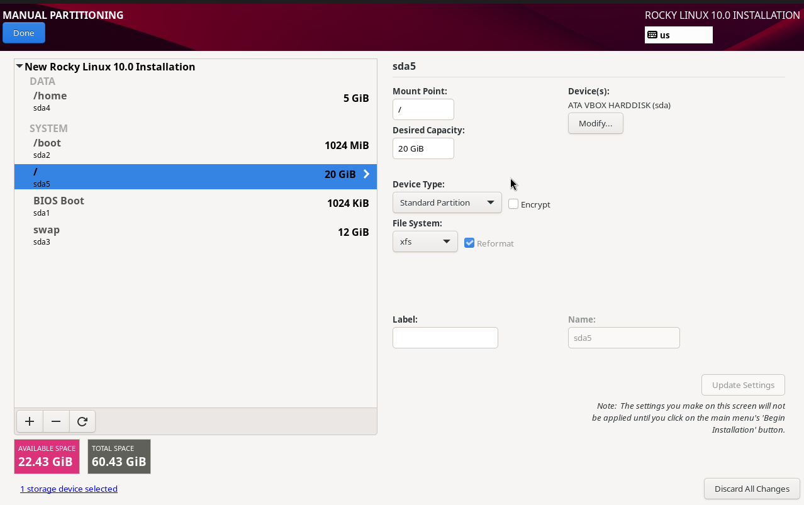
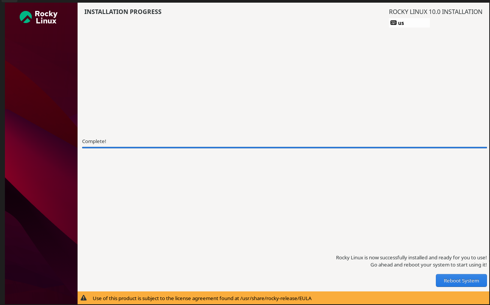
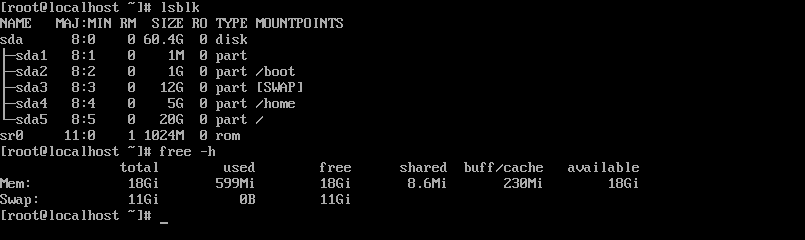

# Bitácora del Proyecto LFS

## Integrantes: Marcelo Avalos 
## Fecha de inicio: 27 de Noviembre Sesión 1: Instalación Rocky Linux 10 Host

### Objetivo: Instalar Rocky Linux 10 como host para LFS

## Tareas Realizadas 
 #### Instalación inicial (18:01 - 18:32)
 - Crear VM (4 CPU, 11.5GB RAM, 60GB disco)
 - Configurar esquema de particiones personalizado
 - Completar instalación básica   

## Comandos ejecutados después de la instalación:

 lsblk 

 free -h

## Resultados:

Particiones: / (20G), /home (5G), swap (12G), libre (22G)

RAM: 11.5GB confirmada

Versión: Rocky Linux 10.0

## Problemas Encontrados

Problema: Tamaño de /home posiblemente muy pequeño

Solución: Como la mayoría de LFS se construye en la partición dedicada, el host no precisa de un /home grande

## Aprendizaje: 
El espacio crítico está en la partición LFS, no en /home del host

## Resultados Obtenidos

Rocky Linux 10 instalado y funcionando 22GB espacio libre reservado para LFS Sistema listo para configuración LFS

## Reflexión Técnica

Los 22GB libres deberían ser suficientes el LFS segun el manual.El swap de 12GB deberia ayudar en compilaciones grandes.La partición /home de 5GB es suficiente para documentación y configuraciones del proyecto

## Evidencias

*Figura 1: Particion del build system*

*Figura 2:  Instalacion completa*

*Figura 3:  Commando lsblk y free -h*

