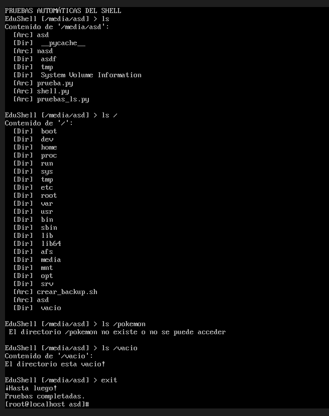
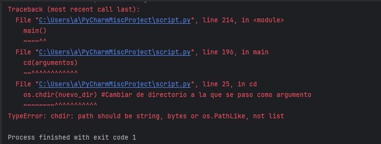
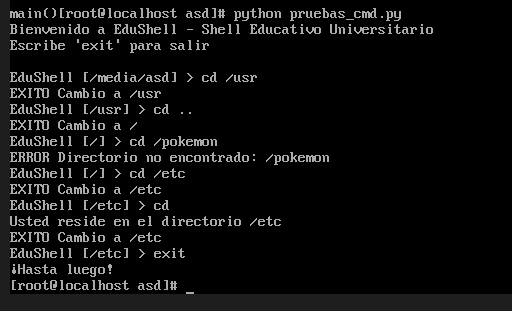
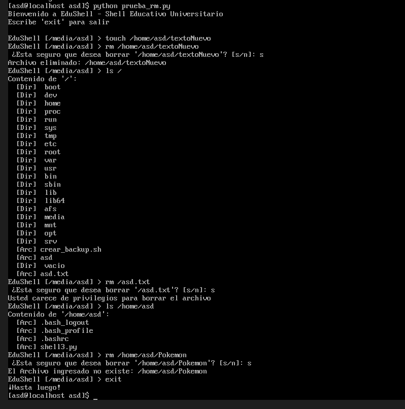
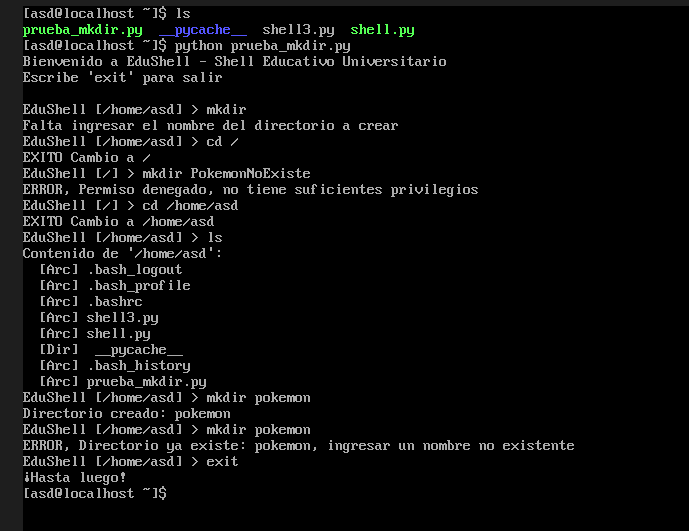

# Fecha: 27 de Noviembre del 2025
# Integrante: Marcelo Avalos
# Enfoque - Shell Educativo Universitario.

## Justificación:

Elegí este enfoque educativo universitario hecho en python porque:

Es un salto grande ir de no manejar muchos comandos, a tener que aprenderse muchos que son requisito para Sistemas Operativos.
Aprender los errores comunes de linux por ejemplo, son difíciles de entender para gente que comienza.
No existe un tutorial “para noobs” en muchos distros, lo cual creo que es una muy buena idea

## Características para diferenciar:

[help]
Descripción: Ayuda integrada que explica no solo que hace cada comando, sino cómo y porqué usar dicho comando.
Valor agregado único:

Explicaciones fáciles de entender con ejemplos relevantes a trabajos de universidad.
Incluye errores comunes y cómo solucionarlos
 

[tutorial]

Descripción: Simulación de comandos que se puede preguntar en el examen de Sistema Operativo por ejemplo. 
Valor agregado único
Ejercicios para proyectos universitarios reales
 Verificación automática de resultados
Progreso lineal y fácil de seguir

## Comandos:

Navegación Básica (pwd, cd, ls)

Gestión de Archivos (cp, rm, cat) 

Organización de Proyectos (mkdir, rutas relativas/absolutas)

Redirección Básica (echo, >, >>)

## Adaptaciones:

Mensajes de Error Educativos:

Estándar: "rm: cannot remove 'file': No such file or directory"

EduShell: "No encuentro 'file' para eliminar. ¿Estás en el directorio correcto? Usa 'ls' para verificar."

Contexto
Normal:  EduShell [~/proyectos] > 

Modo Tutorial: EduShell [TUTORIAL: Navegación] > 

Logs con Propósito Educativo

Registro de progreso en tutoriales

Historial de comandos más utilizados por el estudiante

Identificación de errores comunes para mejorar materiales

## A quién le puede servir:

Primario: Estudiantes de Sistemas Operativos sin experiencia previa.Secundario: Estudiantes que necesitan refuerzo.Terciario: Tutores que quieran guiar prácticas de laboratorio

# Fecha: 27 de Noviembre del 2025
# Integrante: Marcelo Avalos
# Objetivo del día: Crear REPL básico y comando pwd.

## Tareas realizadas:
Enfoque del Trabajo práctico. (16:56 - 17:44)

Crear estructura principal del REPL con bucle while True. (17:44 - 18:11)

Implementar prompt mostrando el directorio actual (EduShell [directorio] >). (18:11 - 18:18)

Añadir comando pwd usando os.getcwd(). (18:18 - 18:20)

Manejo de Ctrl+C mediante captura de KeyboardInterrupt para cierre limpio. (18:20 - 18:47)

Manejo de ejecución directa de python o importado de archivo( __ name __). (18:47 - 19:04)

## Comandos probados:

EduShell [C:\Users\a] > pwd
C:\Users\a

EduShell [C:\Users\a] > exit
¡Hasta luego!

## Problemas encontrados:

Problema:Ctrl+C cerraba el programa agresivamente con un traceback.

Solución:Usar try-except para la captura de KeyboardInterrupt para mostrar mensaje de salida sin error.

Problema: Programa no ejecutaba o solo había un espacio en blanco al tratar de ejecutar.

Solución: Necesitaba indentar apropiadamente main() para que la llamada de función no 
quede dentro de la función misma.

Problema: No se sabía cómo lidiar con las líneas vacías ingresadas por el usuario.

Solucion: Al buscar formas comunes de lidiar, si comando no se le asigna valor, usamos un if
not comando y se ejecuta continúe para que vuelva a hacer el loop y a preguntar por el comando.

Problema:Al hacer el test me daba problemas al importar, el programa se ejecutaba inmediatamente.

Solución: usar la condicional if __name__ == “main”, si el archivo se ejecuta directamente, corre main(), si es importado por otro archivo, no corre main() automáticamente, permitiendo testear con facilidad.

## Evidencias 

*Prueba de pwd, exit, comando no existente y Control+C*

---

# Fecha:8 de Diciembre del 2025
# Integrante: Marcelo Avalos
# Objetivo del día: Crear un parseador básico para el shell

## Tareas realizadas:

(15:20 - 15:47 )

- Crear las variables del parseador y leer caracter por caracter el comando ingresado por el usuario.

(16:47 -  17:01)
- Implementación de separación de tokens y almacenar los tokens en la variable de array tokens

( 17:01- 17:39 )
- Implementación de lógica de los caracteres de escape y entrecomillas.

## Comandos probados:

pwd hola
\”hola\”
“hola”
\\
echo "hola mundo"

Desde cmd:
C:\Users\a\Projecto-LFS-SHELL>python test/prueba_parsedor_1.py

Para ejecutar el script de prueba.

## Problemas encontrados:

Problema: Al separar los tokens por espacio, se crea el problema de ingresar strings, que si el string tiene espacio, entonces se consideran como varios tokens

Solución:Implementar la función de entrecomillado para que el usuario ingrese un string, y ese string se convierta en un solo token con los caracteres espacios parte del token

Problema: Después de implementar la función de entrecomillas, el problema ahora es que no se puede usar comilla de forma literal sin que se considere un flag."

Solución:Implementar la función de carácter de escape (‘\’), al usar este,automáticamente agregamos el próximo carácter,así dejándonos usar comillas de forma literal.

Problema: Para los test de prueba quería correr las pruebas desde root/test, pero el shell está en root/src

Solucion:Gracias a la inteligencia artificial se usa:  

 sys.path.append(os.path.join(os.path.dirname(__file__), '..', 'src'))

En el archivo de prueba_parseador_1 para indicar la ruta relativa entre los archivos. Y también usar archivos __init__.py para que python reconozca los directorios.

Problema: La implementación de mi parseador hace que se le asigne el primer token del array, a la variable comando , que sería el comando principal, pero si estaba vacio, crasheaba el programa.

Solución: Se le detecta si partes tiene al menos 1 elemento con if not partes, y si no tiene simplemente continua al próximo loop.

## Evidencias 

*El output del script de prueba (prueba_parseador_1)*

---

# Fecha:10 de Diciembre del 2025 - Subido un dia despues a Github
# Objetivo del día: Crear una función que permite ejecutar programas externos con os.fork(),execvp()

## Tareas realizadas:

(16:27 -17:15)

- Aprender sobre os.fork()
- Crear la función y ejecutar os.fork() correctamente.

(17:15-  17:56)
- Aprender sobre execvp(),waitpid()
- Completar la función con execvp() y waitpid()

## Comandos probados:

echo ¡Funciona! Perfecto #Imprime ¡Funciona! Perfecto

cat prueba_ejecutar_externo.py #Imprime el script de prueba en terminal

Comando_falso_123 #Error no exite tal comando

## Comando para ejecutar en linux

python prueba_ejecutar_externo.py 
#Se utilizo inteligencia artifical para ayudar a crear el script de prueba

## Problemas encontrados:

Problema: No se sabía cómo comenzar entonces se le preguntó a la inteligencia artificial cuál serían las mejores funciones existentes no prohibidas para usar?

Solución: Sin usar funciones prohibidas, fork(), execvp() y waitpid() fueron las más convincentes

Problema: Varias formas de usar exec  ,y no sabia cual era mejor.

Solucion: Al considerar,cómo se construye en linux, asumimos que muchas de las funciones que queremos usar ya tienen variable de entorno, y como ya guardamos en el formato: comando , argumentos, se decidió usar execvp()

Problema: cuando el programa no encuentra el archivo,OSError emite errno2 No such file, pero no se sabía cómo cambiar el diálogo de error

Solución: Al preguntar a la inteligencia artificial, esto es ENOENT 2, que vendría a ser FileNotFoundError,junto a sys.exit(127) para el comando no encontrado. El resto de los errores posibles lanzan Exception.

## Evidencias 

*El output del script de prueba (prueba ejecutar externo)*

---

# Fecha:13 de Diciembre del 2025
# Objetivo del día: Crear el comando ls para shell.py

## Tareas realizadas:

(20:27 - 20:49 )

Utilizar os.listdir para listar todo en el directorio actual(archivos y directorios)

(20:49 - 21:12)

Utilizar os.path.isdir junto a os.path.join para discernir si el elemento iterado actual es un directorio o archivo

(21:12 - 21:27)
Script y terminaciones finales para cumplir con requisitos minimos

## Comandos probados:

ls                  #Directorio actual
ls /                #Root
ls /pokemon #Directorio inexistente
ls /vacío       #Directorio vacío que imprime que está vacío

Deste terminal:

python pruebas_ls.py

 #Para el script de prueba utilice ayuda de la inteligencia artificial,que termino sugiriendo utilizar mi codigo original para implementar comandos automáticos.

## Problemas encontrados:

Problema: Al recibir los argumentos, si no existe alguno en la variable recibida args, entonces se pasa una lista vacía

Solución: Se inicializa la variable ruta con en el directorio actual (“.”),y si la lista de argumentos no es nula, se le asigna la ruta recibida por args. 

Problema:Originalmente se usaba rutaStr = ruta + “/” + elem y if os.path.isdir(rutaStr) para detectar si es archivo o directorio,sin embargo, esto obviamente puede crear problemas o bugs difíciles de diagnosticar al ingresar el caracter / de más.

Solución: Al hacer una búsqueda por una función existente, por recomendación de la inteligencia artificial se consideró usar os.path.join(ruta,elem). Esto asegura que no existan edge cases que no son fáciles de ver o detectar

## Evidencias 

*El output del script de prueba (prueba_ls)*

---

# Fecha:14 de Diciembre del 2025
# Objetivo del día: Crear la función de cd

## Tareas realizadas:

(18:03 -18:27)

- Aprender sobre os.chdir() y usarlo (Por recomendación de las especificaciones del TP)
- Cambiar de directorio recibido por argumento a la función cd.

(18:27-  18:48)
- Atrapar errores 
- Asegurar que cumpla con los requisitos mínimos exigidos 

(18:48:19:20)
- Crear script de prueba 

## Comandos probados:

- cd /usr  #Accede a /usr
- cd .. #Utiliza ruta relativa
- cd /pokemon #Accede a directorio no existente
- cd /etc #Accede a /etc
- cd  #Permanece en directorio actual
- exit 

## Comando para ejecutar en linux

python prueba_cmd.py #Se utilizó inteligencia artificial para ayudar a pensar como disenhar el script de prueba, tambien shell.py tiene que existir en el mismo directorio para que funcione

## Problemas encontrados:

Problema 1: Si se ingresa solo el comando cd,se recibe la lista de argumentos vacía en la función cd, lanza un error que dice no se puede acceder a args[0],obviamente por que no existen elementos en args y se intenta a acceder a args[0].

Solución: Si la lista no está vacía, se le asigna a nuevo_dir = args[0], si la lista de argumentos esta vacia, se le avisa al usuario en qué directorio reside actualmente y se asigna nuevo_dir = “.”, ruta relativa del directorio actual.

Problema 2:Saltaba el error de que nuevo_dir(el directorio a cambiar) debía ser un string.

Solución: Sin querer,se estaba pasando el argumento completo, y no el primer elemento del argumento a nuevo_dir, al pasarle args[0] se resolvió el problema.

Problema 3: La prueba de ls , corre con parseador y con el comando ls, pero la función main() del shell no se importa en la prueba, esta solución demuestra funcionamiento de ls, pero no es la óptima.

Solución: Con ayuda de inteligencia artificial, está apuntó al camino correcto que es  importar builtins, que permite modificar input() de python por mi función de prueba para ingresar los comandos automáticamente,usando asi tambien la funcion main() del shell.py

## Evidencias 

*El output del error de Problema 2 (error string)*

*El output de pruebas

---

# Fecha:15 de Diciembre del 2025
# Objetivo del día: Crear la función de cp

## Tareas realizadas:

(15:03 -15:57)

- Aprender sobre open() para manipular archivos (como abrir, syntaxis,info sobre bloque, read, write)
- Aceptar argumentos
- Funcion basica que lee archivo y lo copia

(15:57-  16:12)
- Capturar errores correctamente
- Confirmar cumplir con requisitos mínimos
- Utilizar os.path.abspath() para rutas relativas

(16:12 - 16:30 )
- Crear script de prueba 

## Comandos probados:

#Desde un usuario creado

- cp ./shell.py /home/asd/shell3.py  #Copia desde el usb a directorio home del usuario
- ls /home/asd/  #Verificar directorio usuario
- cp /home/asd/shell3.py /shell.py #Copiar desde directorio usuario a root, no tiene permiso
- cp /home/asd/pokemon /home/asd/pokemon2 #Desde directorio usuario al mismo directorio, no existe el archivo pokemon
- exit

python pruebas_cp.py #Ejecutar Script de prueba

#El script de prueba fue reutilizado, es basado en el script de prueba de cd. 

## Problemas encontrados:

Problema: No se sabía cómo usar open() apropiadamente

Solución: Se buscó en la web la documentación de python, junto a este y preguntas a la inteligencia artificial, para dudas de sintaxis, se resolvio este problema.

Problema: No se comprende que tan grande debía ser el bloque y porque

Solución: Para que soporte copiar archivos grandes, no tiene que ser muy chico el bloque o se saturan los recursos, la recomendación encontrada online es entre 64 Kilobytes a 1 Megabyte para mantener balance entre memoria utilizada y rendimiento. Se decidió usar 1 MB.

Problema:El uso de rutas relativas es muy conveniente, pero no se sabía cómo implementarlas

Solución:Entre las funciones del módulo de os, existe os.path.abspath(), que permite escribir la ruta relativa e interpretarla como absoluta en la función, esto permite a la función cp soportar origen y destinos con rutas relativas!.

Problema: No se verificaba si se recibían el número de argumentos correctos,se asume que siempre son dos.

Solución: La función cp solo ejecuta su lógica de copia,si y sólo si hay a lo más y mínimo 2 argumentos pasado por parámetro, si no hay exactamente dos argumentos, la función retorna la forma correcta de utilizarlo y retorna al shell.

Problema:Previamente solo se usaban FileNotFoundError si no se encontraba el archivo y OSError para los demás, pero ahora se quiere capturar error por faltas de permiso.

Solución: Se implementó PermissionError, para poder avisar al usuario que no puede copiar el archivo en el directorio destino ingresado. 

## Evidencias 

*El output de pruebas cp*

---

# Fecha:16 de Diciembre del 2025
# Objetivo del día: Crear la función rm

## Tareas realizadas:

(16:16 -16:45)

- Informarse sobre el comando a utilizar os.unlink()
- Aceptar Argumentos correctamente
- Funcion basica que elimina archivo

(16:45-  14:03)
- Capturar errores correctamente(incluyendo si es directorio)
- Confirmar cumplir con requisitos mínimos

(17:03 - 17:21 )
- Crear script de prueba 

## Comandos probados:

#Desde un usuario creado

- touch /home/asd/textoNuevo  #Crear archivo a borrar
- rm /home/asd/textoNuevo  #Borrar el archivo creado 
- s #Confirmación de la eliminación
- ls / #Listar root (con comando built-in previamente hecho)
- rm /asd.txt #Eliminar archivo en directorio root(sin privilegio para hacerlo)
- rm /home/asd/Pokemon #Eliminar archivo no existente
- exit

python prueba_rm.py #Ejecutar Script de prueba

#El script de prueba fue reutilizado de pruebas previas, y adaptado para rm. 

## Problemas encontrados:

Problema: El usuario al ingresar la confirmación de borrar, si se ingresa S mayúscula, cuenta como cancelación

Solución:como anteriormente se utilizo el método de string para ignorar espacios al comienzo y al final del string( .strip() ), ahora, junto a este se utiliza .lower(), para convertir todo el string en minúscula, y hacer la comparación del input.

Problema: El usuario al confirmar la cancelación de la eliminación del archivo, el archivo se elimina igualmente.

Solución: Falto poner un return después de el print de cancelación para que vuelva al shell, en vez de seguir corriendo el código de eliminación.

Problema: Al tratar de atrapar el error IsADirectoryError, siempre atrapaba PermissionError,sin importar que except estuviese primero.

Solución:Entonces, se decidió verificar manualmente si el archivo a borrar es un directorio, con la función os.path.isdir(archivo). Así, evitando complicarse.

## Evidencias 

*El output de prueba rm*

---

# Fecha:19 de Diciembre del 2025
# Objetivo del día: Crear la función mkdir

## Tareas realizadas:

(18:11 -18:27)

- Aprender a usar mkdir()
- Función que crea directorios

(18:27-  18:35)
- Capturar errores correctamente
- Confirmar cumplir con requisitos mínimos

(18:35- 18:51 )
- Crear script de prueba 

## Comandos probados:

#Desde un usuario creado

- mkdir  #Crear un directorio sin argumento de nombre,Error esperado
- cd /  #Moverse al root
- mkdir PokemonNoExiste #Error de privilegio insuficiente
- cd /home/asd #Moverse al directorio home del usuario, (tiene privilegio)
- ls #Listar archivos y directorios
- mkdir pokemon #Crear el directorio pokemon
- mkdir pokemon #Intentar de crear el mismo directorio, error de directorio ya existente
- exit

python prueba_mkdir.py #Ejecutar Script de prueba

#El script de prueba fue reutilizado 

## Evidencias 

*El output de prueba mkdir*

