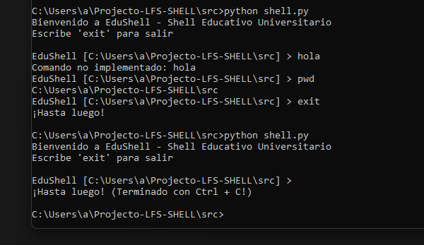
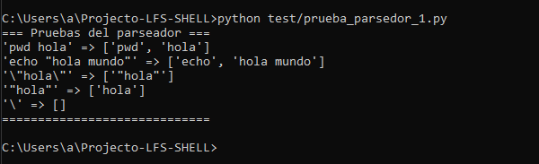
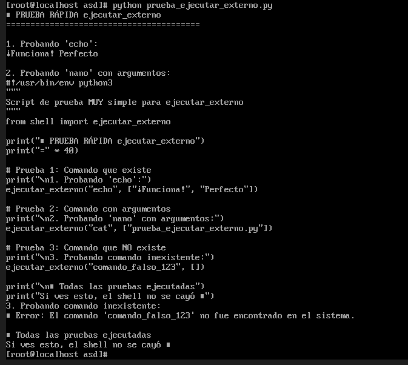

# Fecha: 27 de Noviembre del 2025
# Integrante: Marcelo Avalos
# Enfoque - Shell Educativo Universitario.

## Justificación:

Elegí este enfoque educativo universitario hecho en python porque:

Es un salto grande ir de no manejar muchos comandos, a tener que aprenderse muchos que son requisito para Sistemas Operativos.
Aprender los errores comunes de linux por ejemplo, son difíciles de entender para gente que comienza.
No existe un tutorial “para noobs” en muchos distros, lo cual creo que es una muy buena idea

## Características para diferenciar:

[help]
Descripción: Ayuda integrada que explica no solo que hace cada comando, sino cómo y porqué usar dicho comando.
Valor agregado único:

Explicaciones fáciles de entender con ejemplos relevantes a trabajos de universidad.
Incluye errores comunes y cómo solucionarlos
 

[tutorial]

Descripción: Simulación de comandos que se puede preguntar en el examen de Sistema Operativo por ejemplo. 
Valor agregado único
Ejercicios para proyectos universitarios reales
 Verificación automática de resultados
Progreso lineal y fácil de seguir

## Comandos:

Navegación Básica (pwd, cd, ls)

Gestión de Archivos (cp, rm, cat) 

Organización de Proyectos (mkdir, rutas relativas/absolutas)

Redirección Básica (echo, >, >>)

## Adaptaciones:

Mensajes de Error Educativos:

Estándar: "rm: cannot remove 'file': No such file or directory"

EduShell: "No encuentro 'file' para eliminar. ¿Estás en el directorio correcto? Usa 'ls' para verificar."

Contexto
Normal:  EduShell [~/proyectos] > 

Modo Tutorial: EduShell [TUTORIAL: Navegación] > 

Logs con Propósito Educativo

Registro de progreso en tutoriales

Historial de comandos más utilizados por el estudiante

Identificación de errores comunes para mejorar materiales

## A quién le puede servir:

Primario: Estudiantes de Sistemas Operativos sin experiencia previa.Secundario: Estudiantes que necesitan refuerzo.Terciario: Tutores que quieran guiar prácticas de laboratorio

# Fecha: 27 de Noviembre del 2025
# Integrante: Marcelo Avalos
# Objetivo del día: Crear REPL básico y comando pwd.

## Tareas realizadas:
Enfoque del Trabajo práctico. (16:56 - 17:44)

Crear estructura principal del REPL con bucle while True. (17:44 - 18:11)

Implementar prompt mostrando el directorio actual (EduShell [directorio] >). (18:11 - 18:18)

Añadir comando pwd usando os.getcwd(). (18:18 - 18:20)

Manejo de Ctrl+C mediante captura de KeyboardInterrupt para cierre limpio. (18:20 - 18:47)

Manejo de ejecución directa de python o importado de archivo( __ name __). (18:47 - 19:04)

## Comandos probados:

EduShell [C:\Users\a] > pwd
C:\Users\a

EduShell [C:\Users\a] > exit
¡Hasta luego!

## Problemas encontrados:

Problema:Ctrl+C cerraba el programa agresivamente con un traceback.

Solución:Usar try-except para la captura de KeyboardInterrupt para mostrar mensaje de salida sin error.

Problema: Programa no ejecutaba o solo había un espacio en blanco al tratar de ejecutar.

Solución: Necesitaba indentar apropiadamente main() para que la llamada de función no 
quede dentro de la función misma.

Problema: No se sabía cómo lidiar con las líneas vacías ingresadas por el usuario.

Solucion: Al buscar formas comunes de lidiar, si comando no se le asigna valor, usamos un if
not comando y se ejecuta continúe para que vuelva a hacer el loop y a preguntar por el comando.

Problema:Al hacer el test me daba problemas al importar, el programa se ejecutaba inmediatamente.

Solución: usar la condicional if __name__ == “main”, si el archivo se ejecuta directamente, corre main(), si es importado por otro archivo, no corre main() automáticamente, permitiendo testear con facilidad.

## Evidencias 

*Prueba de pwd, exit, comando no existente y Control+C*

---

# Fecha:8 de Diciembre del 2025
# Integrante: Marcelo Avalos
# Objetivo del día: Crear un parseador básico para el shell

## Tareas realizadas:

(15:20 - 15:47 )

- Crear las variables del parseador y leer caracter por caracter el comando ingresado por el usuario.

(16:47 -  17:01)
- Implementación de separación de tokens y almacenar los tokens en la variable de array tokens

( 17:01- 17:39 )
- Implementación de lógica de los caracteres de escape y entrecomillas.

## Comandos probados:

pwd hola
\”hola\”
“hola”
\\
echo "hola mundo"

Desde cmd:
C:\Users\a\Projecto-LFS-SHELL>python test/prueba_parsedor_1.py

Para ejecutar el script de prueba.

## Problemas encontrados:

Problema: Al separar los tokens por espacio, se crea el problema de ingresar strings, que si el string tiene espacio, entonces se consideran como varios tokens

Solución:Implementar la función de entrecomillado para que el usuario ingrese un string, y ese string se convierta en un solo token con los caracteres espacios parte del token

Problema: Después de implementar la función de entrecomillas, el problema ahora es que no se puede usar comilla de forma literal sin que se considere un flag."

Solución:Implementar la función de carácter de escape (‘\’), al usar este,automáticamente agregamos el próximo carácter,así dejándonos usar comillas de forma literal.

Problema: Para los test de prueba quería correr las pruebas desde root/test, pero el shell está en root/src

Solucion:Gracias a la inteligencia artificial se usa:  

 sys.path.append(os.path.join(os.path.dirname(__file__), '..', 'src'))

En el archivo de prueba_parseador_1 para indicar la ruta relativa entre los archivos. Y también usar archivos __init__.py para que python reconozca los directorios.

Problema: La implementación de mi parseador hace que se le asigne el primer token del array, a la variable comando , que sería el comando principal, pero si estaba vacio, crasheaba el programa.

Solución: Se le detecta si partes tiene al menos 1 elemento con if not partes, y si no tiene simplemente continua al próximo loop.

## Evidencias 

*El output del script de prueba (prueba_parseador_1)*

---

# Fecha:10 de Diciembre del 2025 - Subido un dia despues a Github
# Objetivo del día: Crear una función que permite ejecutar programas externos con os.fork(),execvp()

## Tareas realizadas:

(16:27 -17:15)

- Aprender sobre os.fork()
- Crear la función y ejecutar os.fork() correctamente.

(17:15-  17:56)
- Aprender sobre execvp(),waitpid()
- Completar la función con execvp() y waitpid()

## Comandos probados:

echo ¡Funciona! Perfecto #Imprime ¡Funciona! Perfecto

cat prueba_ejecutar_externo.py #Imprime el script de prueba en terminal

Comando_falso_123 #Error no exite tal comando

## Comando para ejecutar en linux

python prueba_ejecutar_externo.py 
#Se utilizo inteligencia artifical para ayudar a crear el script de prueba

## Problemas encontrados:

Problema: No se sabía cómo comenzar entonces se le preguntó a la inteligencia artificial cuál serían las mejores funciones existentes no prohibidas para usar?

Solución: Sin usar funciones prohibidas, fork(), execvp() y waitpid() fueron las más convincentes

Problema: Varias formas de usar exec  ,y no sabia cual era mejor.

Solucion: Al considerar,cómo se construye en linux, asumimos que muchas de las funciones que queremos usar ya tienen variable de entorno, y como ya guardamos en el formato: comando , argumentos, se decidió usar execvp()

Problema: cuando el programa no encuentra el archivo,OSError emite errno2 No such file, pero no se sabía cómo cambiar el diálogo de error

Solución: Al preguntar a la inteligencia artificial, esto es ENOENT 2, que vendría a ser FileNotFoundError,junto a sys.exit(127) para el comando no encontrado. El resto de los errores posibles lanzan Exception.

## Evidencias 

*El output del script de prueba (prueba ejecutar externo)*
